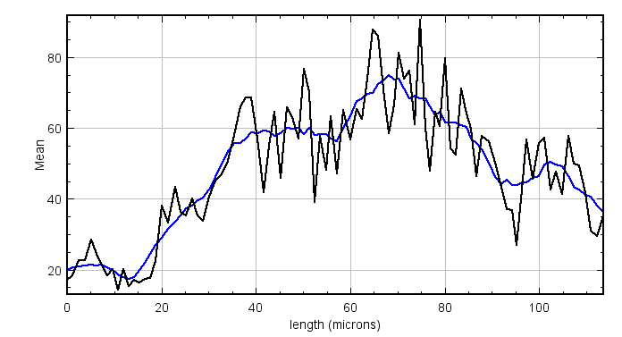

#  BIOIMAGING - INEB/i3S
Eduardo Conde-Sousa (econdesousa@gmail.com)

## Extended Plot Profile

* Runs over all ROIs and get point coordinates
* For each it expands in 3D (image units) and add to 3d manager
* at the end it gets 3d quantif
 
 
### code version
2.1

	
### last modification
01/10/2021

### Requirements
* update sites (see https://imagej.net/plugins/morpholibj#installation):
	* IJPB-plugins
	* CLIJ2
	


### Attribution:
If you use this macro please add in the acknowledgements of your papers and/or thesis (MSc and PhD) the reference to Bioimaging and the project PPBI-POCI-01-0145-FEDER-022122.
As a suggestion you may use the following sentence:
 * The authors acknowledge the support of the i3S Scientific Platform Bioimaging, member of the national infrastructure PPBI - Portuguese Platform of Bioimaging (PPBI-POCI-01-0145-FEDER-022122).

please cite:
* this macro
* SNT: https://www.nature.com/articles/s41592-021-01105-7
* CLIJ https://www.nature.com/articles/s41592-019-0650-1


```java


```

# Setup

```java

if (batchModeFlag) {
	setBatchMode(true);
}else {
	setBatchMode(false);
}

// if mindistRadius != 0 the a downsample will be applied
// to all points in ROIs
// here we select the minimum distance between two consecutive points

mindistRadius = 0;
if (minDistFlag) {
	mindistRadius = getNumber("distance between adjacent ROI points to consider", nRadius);
}


// if one image is open, check if it is the correct
// otherwise, close all and ask for a new image
if (nImages!=1){
	close("*");
	filePath = File.openDialog("open image");
	open(filePath);
	main = getTitle();
	dir=getDirectory("image");

}else {
	main = getTitle();
	dir=getDirectory("image");
	continueFlag = getBoolean("input image:\n" + main+"\nproceed ?");
	if (!continueFlag){
		exit("stopped by user");
	}
}


// if ROI manager already open and filled continue, otherwise ask for ROIs
if (roiManager("count")<1){
	roiPath = File.openDialog("open ROI");
	roiManager("open", roiPath);
}


// reset results table (if open)
resetResults();
function resetResults(){
	list = getList("window.titles");
	for (i = 0; i < lengthOf(list); i++) {
		if (indexOf(list[i],"Results")>=0) {
			selectWindow(list[i]);run("Close");
		}
	}
}


// get image name and duplicate the target channel
mainName=substring(main, 0,lastIndexOf(main, "."));
run("Duplicate...", "title="+mainName+" duplicate channels="+quantifChannel);
id=getImageID();


// Set output directory to a (new) folder named Results/IMAGENAME
outDir=dir+"results"+File.separator;
if (!File.exists(outDir)) {
	File.makeDirectory(outDir);
}
outDir=outDir + mainName + File.separator;
if (!File.exists(outDir)) {
	File.makeDirectory(outDir);
}


// voxel size
var width;
var height;
var depth; 		// original depth
var newDepth;	// depth after reslicing
var unit;
getVoxelSize(width, height, depth, unit);
// report parameters
print("\\Clear");
print("Quantif channel:",quantifChannel);
print("neurite radius (in "+unit+")", nRadius);
print("minimum distance between ROI points (in "+unit+")",mindistRadius);


// Each point of the ROIs (or downsample of it)
// will be enlarged by a fixed radius
// here we set the value in voxels from
// the user input in physical units
dilationNumber = nRadius / width;
print("neurite radius (in voxels)", dilationNumber);


```
<pre>
> Quantif channel: 1
> neurite radius (in microns) 1
> minimum distance between ROI points (in microns) 1
> neurite radius (in voxels) 6.93
</pre>
<a href="image_1633098220805.png"></a>
<a href="image_1633098221566.png"></a>

# check image dimensions

```java
var w;
var h;
var c;
var s;
var f;
Stack.getDimensions(w, h, c, s, f);
if (c>1 || f > 1){
	exit("Not prepared to deal with multiple time frames or channels");
}


```

# Get roi(s) coordinates

```java
var xvec = newArray(); 		// these vectors will store ROI coordinates in voxel units
var yvec = newArray(); 
var zvec = newArray();
var xvecUnits = newArray(); // these vectors will store ROI coordinates in physical units
var	yvecUnits = newArray();
var	zvecUnits = newArray();

for (i = 0; i < roiManager("count"); i++) {
	selectImage(id);
	getVoxelSize(width, height, depth, unit);
	roiManager("select", i);
	Stack.getPosition(channel, slice, frame);
	getSelectionCoordinates(xpoints, ypoints);
	xvec = Array.concat(xvec,xpoints);
	yvec = Array.concat(yvec,ypoints);
	for (j = 0; j < lengthOf(xpoints); j++) {
		zvec = Array.concat(zvec,slice);
	}
}

```
<a href="image_1633098224481.png"></a>

# create label image from ROI coords 

```java

label="label";
resliceImage(label,mainName);

function resliceImage(label,mainName){

	resliceFlag = false;
	if (abs(width/depth-1)>0.1 ) { // more than 10% difference between voxel width and depth
		resliceFlag = true;
	}

	if (resliceFlag) {
		newImage(label+"_garbage", "32-bit black", w, h, s);
		setVoxelSize(width, height, depth, unit);
		run("Reslice Z", "new="+width);
		rename(label);
		labelID=getImageID();
		selectWindow(label+"_garbage");
		close();	
		selectImage(labelID);
		for (iter = 0; iter < lengthOf(zvec); iter++) {
			zvec[iter] = round(zvec[iter] * depth / width ); // rescale zvec to the new image size
		}
		selectWindow(mainName);rename(mainName+"_originalSize");
		id2close=getImageID();
		run("Reslice Z", "new="+width);
		rename(mainName);
		selectImage(id2close);close();
		selectWindow(mainName);
	}else {
		newImage(label, "32-bit black", w, h, s);
		setVoxelSize(width, height, depth, unit);
	}	
	getVoxelSize(width, height, newDepth, unit);
}


```
<a href="image_1633098229306.png"></a>
<a href="image_1633098229457.png"></a>

# Rescale coords vectors

```java
scaleVecsImageUnits(xvec,yvec,zvec);
function scaleVecsImageUnits(xvec,yvec,zvec){
	xvecUnits = Array.copy(xvec);
	yvecUnits = Array.copy(yvec);
	zvecUnits = Array.copy(zvec);
	for (i = 0; i < lengthOf(xvecUnits); i++) {
		xvecUnits[i] = xvecUnits[i] * width;
		yvecUnits[i] = yvecUnits[i] * height;
		zvecUnits[i] = zvecUnits[i] * newDepth;
	}
}

```

# get points indexes according to distance

```java

// only indexes of points separated by nRadius will be kept

vec = getDistanceConstrain(xvecUnits,yvecUnits,zvecUnits,mindistRadius);

function getDistanceConstrain(X,Y,Z,thresholdDist){
	vec=newArray(1);
	vec[0]= 0;
	ptx=X[0];
	pty=Y[0];
	ptz=Z[0];	
	for (i = 1; i < lengthOf(X); i++) {	
		sq1=pow(X[i]-ptx,2);
		sq2=pow(Y[i]-pty,2);
		sq3=pow(Z[i]-ptz,2);
		dist=sqrt(sq1+sq2+sq3);
		if (dist >= thresholdDist) {
			vec= Array.concat(vec,i);
			ptx=X[i];
			pty=Y[i];
			ptz=Z[i];
		}
	}
	return vec;
}

```

# fill labels

```java
fillLabels(label,xvec,yvec,zvec,vec);
 
function fillLabels(label,xvec,yvec,zvec,vec) {

	selectWindow(label);
	

	for (i = 0; i < lengthOf(vec); i++) {
		Stack.setSlice(round(zvec[vec[i]]  ));
		makeOval(xvec[vec[i]], yvec[vec[i]], 1, 1);
		j=i+1;
		run("Set...","value="+j);
	}

	setMinAndMax(0, j);
	run("glasbey_on_dark");
}

```
<a href="image_1633098231844.png"></a>

# Dilate Labels

```java

dilateLabelsCLIJ(label, dilationNumber);

function dilateLabelsCLIJ(label, dilationNumber) { 

	run("CLIJ2 Macro Extensions", "cl_device=[]");
	selectWindow(label);
	getVoxelSize(width, height, newDepth, unit);
	run("Select None");
	Ext.CLIJ2_push(label);
	//close();
	output = label+"Dilated";
	Ext.CLIJ2_dilateLabels(label, output, dilationNumber);
	Ext.CLIJ2_getMaximumOfAllPixels(label, j);
	Ext.CLIJ2_pull(output);
	setMinAndMax(0, j);
	run("glasbey_on_dark");
	Ext.CLIJ2_release(label);
	Ext.CLIJ2_release(output);
	Ext.CLIJ2_release(j);
	setVoxelSize(width, height, newDepth, unit);
}


```
<a href="image_1633098236044.png"></a>
<a href="image_1633098236320.png"></a>

# Quantifications

```java

// Get centroids and distance between centrois
run("Analyze Regions 3D", "centroid surface_area_method=[Crofton (13 dirs.)] euler_connectivity=26");
X=Table.getColumn("Centroid.X");
Y=Table.getColumn("Centroid.Y");
Z=Table.getColumn("Centroid.Z");

// measure 3D distance between consecutive points
dist = getDistance(X,Y,Z);

function getDistance(xvec,yvec,zvec){
	vec=newArray(lengthOf(xvec));
	vec[0]= 0;
	for (i = 1; i < lengthOf(vec); i++) {	
		sq1=pow(xvec[i]-xvec[i-1],2);
		sq2=pow(yvec[i]-yvec[i-1],2);
		sq3=pow(zvec[i]-zvec[i-1],2);
		vec[i]=sqrt(sq1+sq2+sq3);
	}
	return vec;
}

Table.rename("CENTROIDS");
selectWindow("CENTROIDS");run("Close");

// Intensity Measurements
run("Intensity Measurements 2D/3D", "input="+mainName+" labels="+label+"Dilated"+" mean stddev max min median mode skewness volume");
Table.rename("Results");

// Complete Results table with centrois & distance info
selectWindow("Results");
Table.setColumn("SpaceBetweenPoints", dist);
cumdist=newArray(lengthOf(dist));
for (i = 1; i < lengthOf(cumdist); i++) {
	cumdist[i]=cumdist[i-1]+dist[i];
}
selectWindow("Results");
Table.setColumn("Distance", cumdist);
selectWindow("Results");
meanIntensity=Table.getColumn("Mean");

```
<table>
<tr><th>Label</th><th>Mean</th><th>StdDev</th><th>Max</th><th>Min</th><th>Median</th><th>Mode</th><th>Skewness</th><th>Volume</th><th>SpaceBetweenPoints</th><th>Distance</th></tr>
<tr><td>1</td><td>17.141666667</td><td>9.313695859</td><td>66</td><td>4</td><td>15</td><td>12</td><td>1.601017169</td><td>3.605632701</td><td>0.000000000</td><td>0.000000000</td></tr>
<tr><td>2</td><td>18.470646766</td><td>11.122671217</td><td>90</td><td>5</td><td>16</td><td>10</td><td>1.795720258</td><td>3.019717387</td><td>1.140169138</td><td>1.140169138</td></tr>
<tr><td>3</td><td>22.761126249</td><td>11.760328956</td><td>78</td><td>4</td><td>20</td><td>17</td><td>1.314930912</td><td>3.308168004</td><td>1.257460837</td><td>2.397629975</td></tr>
<tr><td>4</td><td>22.665124884</td><td>12.571011071</td><td>99</td><td>6</td><td>19</td><td>20</td><td>1.843376404</td><td>3.248074125</td><td>1.329162561</td><td>3.726792536</td></tr>
<tr><td>5</td><td>28.417853751</td><td>11.440259145</td><td>77</td><td>8</td><td>27</td><td>23</td><td>0.653071148</td><td>3.163942695</td><td>1.292828081</td><td>5.019620617</td></tr>
<tr><td>6</td><td>24.338967136</td><td>16.636535191</td><td>140</td><td>5</td><td>20</td><td>13</td><td>2.701149511</td><td>3.199999023</td><td>1.148884943</td><td>6.168505560</td></tr>
<tr><td>7</td><td>21.198874296</td><td>13.561265287</td><td>104</td><td>4</td><td>17</td><td>11</td><td>1.686141663</td><td>3.203003716</td><td>1.179826503</td><td>7.348332064</td></tr>
<tr><td>8</td><td>18.289597001</td><td>12.789094263</td><td>90</td><td>4</td><td>15</td><td>11</td><td>2.243481218</td><td>3.206008410</td><td>1.147559062</td><td>8.495891126</td></tr>
<tr><td>9</td><td>20.182608696</td><td>12.949791073</td><td>96</td><td>4</td><td>16</td><td>12</td><td>1.702335722</td><td>3.109858205</td><td>1.123153488</td><td>9.619044614</td></tr>
<tr><td>10</td><td>14.232876712</td><td>13.328550912</td><td>133</td><td>3</td><td>11</td><td>8</td><td>3.926095657</td><td>3.070797184</td><td>1.146448152</td><td>10.765492766</td></tr>
<tr><td>11</td><td>20.197087379</td><td>17.008136010</td><td>90</td><td>3</td><td>14</td><td>9</td><td>1.678012586</td><td>3.094834735</td><td>1.210081967</td><td>11.975574733</td></tr>
<tr><td>12</td><td>15.347784200</td><td>8.402532529</td><td>74</td><td>3</td><td>14</td><td>12</td><td>2.070008414</td><td>3.118872287</td><td>1.142190102</td><td>13.117764835</td></tr>
<tr><td>13</td><td>17.038852914</td><td>8.777882399</td><td>67</td><td>4</td><td>15</td><td>15</td><td>1.431059601</td><td>3.248074125</td><td>1.111516784</td><td>14.229281618</td></tr>
<tr><td>14</td><td>16.443830571</td><td>9.441887476</td><td>62</td><td>3</td><td>15</td><td>15</td><td>1.237368445</td><td>3.263097595</td><td>1.127573388</td><td>15.356855006</td></tr>
<tr><td>15</td><td>17.317261331</td><td>11.323958482</td><td>69</td><td>4</td><td>14</td><td>7</td><td>1.299253968</td><td>3.115867593</td><td>1.127385688</td><td>16.484240694</td></tr>
<tr><td>16</td><td>17.668246445</td><td>9.996107596</td><td>91</td><td>4</td><td>15</td><td>14</td><td>2.277411709</td><td>3.169952083</td><td>1.076517742</td><td>17.560758436</td></tr>
<tr><td>17</td><td>22.504712939</td><td>17.470202912</td><td>142</td><td>4</td><td>17</td><td>12</td><td>2.493403880</td><td>3.506477802</td><td>1.186825271</td><td>18.747583707</td></tr>
<tr><td>18</td><td>38.140408163</td><td>19.899581573</td><td>121</td><td>5</td><td>34</td><td>24</td><td>0.925942034</td><td>3.680750049</td><td>1.325728683</td><td>20.073312389</td></tr>
<tr><td>19</td><td>33.285384615</td><td>15.145477170</td><td>100</td><td>4</td><td>30</td><td>21</td><td>1.047264755</td><td>3.906102093</td><td>1.328181790</td><td>21.401494179</td></tr>
<tr><td>20</td><td>43.260399334</td><td>28.089876775</td><td>145</td><td>4</td><td>37</td><td>12</td><td>0.803770585</td><td>3.611642089</td><td>1.469785391</td><td>22.871279571</td></tr>
<tr><td>21</td><td>36.221912721</td><td>28.790279407</td><td>158</td><td>4</td><td>27</td><td>10</td><td>1.357574232</td><td>3.236055350</td><td>1.179320611</td><td>24.050600181</td></tr>
<tr><td>22</td><td>35.252747253</td><td>30.959447684</td><td>148</td><td>4</td><td>24</td><td>8</td><td>1.321554842</td><td>3.281125758</td><td>1.173906879</td><td>25.224507061</td></tr>
<tr><td>23</td><td>40.194706994</td><td>20.637383499</td><td>126</td><td>8</td><td>35</td><td>25</td><td>1.112162352</td><td>3.178966165</td><td>1.304106030</td><td>26.528613090</td></tr>
<tr><td>24</td><td>35.280155642</td><td>22.027426201</td><td>151</td><td>3</td><td>29</td><td>21</td><td>1.520736320</td><td>3.088825348</td><td>1.143402782</td><td>27.672015872</td></tr>
<tr><td>25</td><td>33.673310225</td><td>22.777802406</td><td>154</td><td>4</td><td>28</td><td>20</td><td>1.675881026</td><td>3.467416781</td><td>1.139750481</td><td>28.811766353</td></tr>
<tr><td>26</td><td>40.563880126</td><td>34.012706682</td><td>162</td><td>3</td><td>28</td><td>13</td><td>1.289405917</td><td>3.809951888</td><td>1.340972689</td><td>30.152739043</td></tr>
<tr><td>27</td><td>45.190517998</td><td>43.350417512</td><td>187</td><td>4</td><td>26</td><td>13</td><td>1.308766136</td><td>3.422346372</td><td>1.315756876</td><td>31.468495918</td></tr>
<tr><td>28</td><td>46.577720207</td><td>46.389491183</td><td>224</td><td>4</td><td>27</td><td>16</td><td>1.574508534</td><td>3.479435557</td><td>1.179059532</td><td>32.647555451</td></tr>
<tr><td>29</td><td>49.918981481</td><td>44.965062681</td><td>211</td><td>4</td><td>32</td><td>10</td><td>1.320887713</td><td>3.894083318</td><td>1.313509776</td><td>33.961065227</td></tr>
<tr><td>30</td><td>57.947981366</td><td>48.219183790</td><td>221</td><td>3</td><td>40</td><td>13</td><td>1.239158308</td><td>3.870045766</td><td>1.424883701</td><td>35.385948928</td></tr>
<tr><td>31</td><td>66.185739437</td><td>54.377833494</td><td>229</td><td>3</td><td>46</td><td>13</td><td>0.930492096</td><td>3.413332291</td><td>1.316934831</td><td>36.702883759</td></tr>
<tr><td>32</td><td>68.593439364</td><td>53.327793833</td><td>243</td><td>6</td><td>50</td><td>11</td><td>0.952467431</td><td>3.022722081</td><td>1.157963036</td><td>37.860846796</td></tr>
<tr><td>33</td><td>68.663590604</td><td>52.565252672</td><td>221</td><td>4</td><td>55</td><td>8</td><td>0.688440912</td><td>3.581595150</td><td>1.156632361</td><td>39.017479156</td></tr>
<tr><td>34</td><td>57.047154472</td><td>40.243337731</td><td>203</td><td>4</td><td>47</td><td>11</td><td>0.943330066</td><td>3.695773519</td><td>1.390216498</td><td>40.407695655</td></tr>
<tr><td>35</td><td>41.854791868</td><td>26.373191432</td><td>151</td><td>5</td><td>37</td><td>30</td><td>0.816798571</td><td>3.103848817</td><td>1.206288935</td><td>41.613984590</td></tr>
<tr><td>36</td><td>55.091185410</td><td>36.909618702</td><td>197</td><td>6</td><td>45</td><td>22</td><td>1.075196790</td><td>2.965632897</td><td>1.090555483</td><td>42.704540073</td></tr>
<tr><td>37</td><td>64.583416583</td><td>49.901213949</td><td>209</td><td>5</td><td>46</td><td>27</td><td>1.054500067</td><td>3.007698612</td><td>1.137720020</td><td>43.842260093</td></tr>
<tr><td>38</td><td>45.925218775</td><td>32.394163643</td><td>152</td><td>3</td><td>36</td><td>30</td><td>0.925325167</td><td>3.776900255</td><td>1.319569664</td><td>45.161829757</td></tr>
<tr><td>39</td><td>65.880106572</td><td>52.438400082</td><td>252</td><td>6</td><td>46</td><td>22</td><td>1.192133829</td><td>3.383285351</td><td>1.476521239</td><td>46.638350997</td></tr>
<tr><td>40</td><td>63.039819005</td><td>46.543107523</td><td>238</td><td>7</td><td>47</td><td>34</td><td>1.240015556</td><td>3.320186779</td><td>1.144316347</td><td>47.782667344</td></tr>
<tr><td>41</td><td>56.927111111</td><td>42.468184412</td><td>195</td><td>7</td><td>39</td><td>23</td><td>1.193279022</td><td>3.380280658</td><td>1.197859640</td><td>48.980526983</td></tr>
<tr><td>42</td><td>76.584014532</td><td>56.683975654</td><td>238</td><td>7</td><td>57</td><td>16</td><td>0.718151334</td><td>3.308168004</td><td>1.156067517</td><td>50.136594500</td></tr>
<tr><td>43</td><td>69.996254682</td><td>56.499859012</td><td>236</td><td>5</td><td>56</td><td>11</td><td>0.706967691</td><td>3.209013104</td><td>1.180260190</td><td>51.316854689</td></tr>
<tr><td>44</td><td>39.138594803</td><td>36.759290922</td><td>177</td><td>4</td><td>22</td><td>15</td><td>1.500316811</td><td>3.121876981</td><td>1.144616376</td><td>52.461471065</td></tr>
<tr><td>45</td><td>57.811688312</td><td>35.368229571</td><td>217</td><td>8</td><td>51</td><td>14</td><td>1.120291976</td><td>3.239060043</td><td>1.147684722</td><td>53.609155787</td></tr>
<tr><td>46</td><td>48.121906508</td><td>27.133353448</td><td>146</td><td>6</td><td>42</td><td>28</td><td>1.117799097</td><td>3.278121064</td><td>1.207249084</td><td>54.816404871</td></tr>
<tr><td>47</td><td>63.392430279</td><td>48.037080864</td><td>199</td><td>8</td><td>46</td><td>12</td><td>0.917320709</td><td>3.016712694</td><td>1.124290702</td><td>55.940695573</td></tr>
<tr><td>48</td><td>47.230046948</td><td>39.492087976</td><td>193</td><td>4</td><td>33</td><td>21</td><td>1.408034025</td><td>3.199999023</td><td>1.226731654</td><td>57.167427227</td></tr>
<tr><td>49</td><td>65.075809199</td><td>43.445713576</td><td>206</td><td>4</td><td>54</td><td>44</td><td>0.941099986</td><td>3.527510660</td><td>1.369105011</td><td>58.536532238</td></tr>
<tr><td>50</td><td>56.655228758</td><td>51.702853445</td><td>233</td><td>4</td><td>35</td><td>17</td><td>1.234904217</td><td>3.677745355</td><td>1.424571664</td><td>59.961103902</td></tr>
<tr><td>51</td><td>65.203237410</td><td>59.832816153</td><td>244</td><td>4</td><td>40</td><td>9</td><td>1.072681245</td><td>3.341219637</td><td>1.290752781</td><td>61.251856683</td></tr>
<tr><td>52</td><td>62.567567568</td><td>58.839739627</td><td>218</td><td>3</td><td>43</td><td>11</td><td>1.059662148</td><td>3.224036574</td><td>1.136070590</td><td>62.387927273</td></tr>
<tr><td>53</td><td>73.976982097</td><td>64.359301385</td><td>235</td><td>4</td><td>57</td><td>13</td><td>0.807276600</td><td>3.524505966</td><td>1.192865728</td><td>63.580793002</td></tr>
<tr><td>54</td><td>87.712477396</td><td>58.432389082</td><td>241</td><td>4</td><td>82</td><td>14</td><td>0.375055309</td><td>3.323191473</td><td>1.228185037</td><td>64.808978039</td></tr>
<tr><td>55</td><td>85.936594203</td><td>58.410447696</td><td>228</td><td>4</td><td>90</td><td>19</td><td>0.194849226</td><td>3.317182085</td><td>1.155436825</td><td>65.964414864</td></tr>
<tr><td>56</td><td>70.936354870</td><td>47.584992726</td><td>221</td><td>4</td><td>70</td><td>7</td><td>0.375909965</td><td>3.115867593</td><td>1.135715157</td><td>67.100130021</td></tr>
<tr><td>57</td><td>58.435643564</td><td>50.924602749</td><td>220</td><td>5</td><td>33</td><td>10</td><td>0.709706057</td><td>3.034740857</td><td>1.062025272</td><td>68.162155292</td></tr>
<tr><td>58</td><td>66.470588235</td><td>44.487679949</td><td>210</td><td>4</td><td>72</td><td>14</td><td>0.197934205</td><td>3.115867593</td><td>1.062282277</td><td>69.224437569</td></tr>
<tr><td>59</td><td>81.174119886</td><td>60.851937229</td><td>243</td><td>3</td><td>89</td><td>9</td><td>0.260650207</td><td>3.157933308</td><td>1.079713006</td><td>70.304150576</td></tr>
<tr><td>60</td><td>73.793621013</td><td>56.676715595</td><td>239</td><td>3</td><td>70</td><td>9</td><td>0.634999317</td><td>3.203003716</td><td>1.099756716</td><td>71.403907291</td></tr>
<tr><td>61</td><td>76.259052925</td><td>47.249753496</td><td>215</td><td>3</td><td>71</td><td>9</td><td>0.557933142</td><td>3.236055350</td><td>1.132518447</td><td>72.536425738</td></tr>
<tr><td>62</td><td>61.143809524</td><td>52.604284497</td><td>221</td><td>3</td><td>56</td><td>4</td><td>0.614144298</td><td>3.154928614</td><td>1.134732361</td><td>73.671158099</td></tr>
<tr><td>63</td><td>90.668273867</td><td>48.170681414</td><td>225</td><td>4</td><td>97</td><td>115</td><td>-0.115365118</td><td>3.115867593</td><td>1.106734828</td><td>74.777892927</td></tr>
<tr><td>64</td><td>60.094503375</td><td>53.172820424</td><td>234</td><td>3</td><td>48</td><td>5</td><td>0.816469512</td><td>3.115867593</td><td>1.072097862</td><td>75.849990789</td></tr>
<tr><td>65</td><td>47.857005758</td><td>49.015016833</td><td>204</td><td>3</td><td>22</td><td>4</td><td>0.933260925</td><td>3.130891062</td><td>1.061412893</td><td>76.911403682</td></tr>
<tr><td>66</td><td>64.497492477</td><td>48.451707375</td><td>202</td><td>3</td><td>68</td><td>4</td><td>0.320178515</td><td>2.995679836</td><td>1.020633635</td><td>77.932037317</td></tr>
<tr><td>67</td><td>60.483965015</td><td>53.550961945</td><td>208</td><td>3</td><td>44</td><td>4</td><td>0.484213963</td><td>3.091830041</td><td>1.038587422</td><td>78.970624740</td></tr>
<tr><td>68</td><td>79.709586466</td><td>47.952957664</td><td>203</td><td>3</td><td>92</td><td>5</td><td>-0.189343681</td><td>3.196994329</td><td>1.070699587</td><td>80.041324326</td></tr>
<tr><td>69</td><td>54.207706767</td><td>45.511060962</td><td>193</td><td>3</td><td>41</td><td>4</td><td>0.602252942</td><td>3.196994329</td><td>1.106282708</td><td>81.147607034</td></tr>
<tr><td>70</td><td>52.532871972</td><td>42.838937020</td><td>163</td><td>3</td><td>42</td><td>4</td><td>0.430129763</td><td>3.473426169</td><td>1.139343930</td><td>82.286950964</td></tr>
<tr><td>71</td><td>71.178272981</td><td>41.135843662</td><td>178</td><td>3</td><td>69</td><td>5</td><td>0.265892821</td><td>3.236055350</td><td>1.211261796</td><td>83.498212760</td></tr>
<tr><td>72</td><td>64.127272727</td><td>43.610060653</td><td>184</td><td>3</td><td>58</td><td>5</td><td>0.590373143</td><td>3.139905144</td><td>1.034112322</td><td>84.532325083</td></tr>
<tr><td>73</td><td>59.836095764</td><td>38.896623924</td><td>184</td><td>4</td><td>56</td><td>9</td><td>0.710355724</td><td>3.263097595</td><td>1.115728647</td><td>85.648053730</td></tr>
<tr><td>74</td><td>46.323193916</td><td>39.009189154</td><td>180</td><td>3</td><td>34</td><td>5</td><td>0.726678819</td><td>3.160938002</td><td>1.121615233</td><td>86.769668963</td></tr>
<tr><td>75</td><td>57.790638298</td><td>37.903107120</td><td>176</td><td>3</td><td>58</td><td>5</td><td>0.421368170</td><td>3.530515353</td><td>1.115456770</td><td>87.885125733</td></tr>
<tr><td>76</td><td>56.169078446</td><td>37.329337115</td><td>170</td><td>3</td><td>55</td><td>9</td><td>0.472072829</td><td>3.945163114</td><td>1.395573392</td><td>89.280699125</td></tr>
<tr><td>77</td><td>50.102976669</td><td>33.054561528</td><td>166</td><td>3</td><td>45</td><td>26</td><td>0.823092600</td><td>3.734834540</td><td>1.490692487</td><td>90.771391612</td></tr>
<tr><td>78</td><td>43.389298893</td><td>25.151968295</td><td>155</td><td>4</td><td>41</td><td>37</td><td>1.031287352</td><td>3.257088207</td><td>1.246378524</td><td>92.017770136</td></tr>
<tr><td>79</td><td>37.145575642</td><td>25.827738040</td><td>207</td><td>3</td><td>35</td><td>6</td><td>1.435287685</td><td>3.157933308</td><td>1.073190863</td><td>93.090960999</td></tr>
<tr><td>80</td><td>36.798303487</td><td>25.287467642</td><td>115</td><td>3</td><td>37</td><td>4</td><td>0.255738530</td><td>3.187980247</td><td>1.101431467</td><td>94.192392466</td></tr>
<tr><td>81</td><td>26.988944724</td><td>23.495511779</td><td>114</td><td>3</td><td>17</td><td>4</td><td>0.998078037</td><td>2.989670448</td><td>1.074667821</td><td>95.267060286</td></tr>
<tr><td>82</td><td>42.717948718</td><td>29.774320994</td><td>127</td><td>3</td><td>44</td><td>8</td><td>0.402265947</td><td>3.046759633</td><td>1.070121881</td><td>96.337182168</td></tr>
<tr><td>83</td><td>56.617760618</td><td>31.620069521</td><td>147</td><td>4</td><td>59</td><td>9</td><td>0.111730609</td><td>3.112862899</td><td>1.056479580</td><td>97.393661748</td></tr>
<tr><td>84</td><td>45.616071429</td><td>33.309491766</td><td>134</td><td>5</td><td>38</td><td>10</td><td>0.590944055</td><td>3.701782907</td><td>1.154434977</td><td>98.548096725</td></tr>
<tr><td>85</td><td>55.853852967</td><td>34.850546222</td><td>180</td><td>5</td><td>53</td><td>24</td><td>0.628691331</td><td>3.392299433</td><td>1.423904526</td><td>99.972001251</td></tr>
<tr><td>86</td><td>57.123827392</td><td>30.047018420</td><td>167</td><td>5</td><td>55</td><td>17</td><td>0.343800051</td><td>3.203003716</td><td>1.192827957</td><td>101.164829208</td></tr>
<tr><td>87</td><td>42.665784832</td><td>28.445689650</td><td>139</td><td>4</td><td>38</td><td>7</td><td>0.586932678</td><td>3.407322903</td><td>1.266273350</td><td>102.431102558</td></tr>
<tr><td>88</td><td>47.687279152</td><td>27.127387241</td><td>153</td><td>4</td><td>44</td><td>35</td><td>0.652461204</td><td>3.401313515</td><td>1.200858770</td><td>103.631961327</td></tr>
<tr><td>89</td><td>41.423940150</td><td>16.041037111</td><td>96</td><td>6</td><td>40</td><td>35</td><td>0.571808835</td><td>3.614646783</td><td>1.216074373</td><td>104.848035700</td></tr>
<tr><td>90</td><td>57.775601069</td><td>24.436944344</td><td>135</td><td>15</td><td>53</td><td>41</td><td>0.805235903</td><td>3.374271270</td><td>1.277879470</td><td>106.125915171</td></tr>
<tr><td>91</td><td>49.865302643</td><td>30.027988050</td><td>139</td><td>5</td><td>44</td><td>15</td><td>0.760555900</td><td>3.524505966</td><td>1.178338498</td><td>107.304253668</td></tr>
<tr><td>92</td><td>49.356188780</td><td>29.550589378</td><td>156</td><td>4</td><td>44</td><td>36</td><td>0.680026166</td><td>3.374271270</td><td>1.254454432</td><td>108.558708100</td></tr>
<tr><td>93</td><td>41.554065381</td><td>31.924270759</td><td>142</td><td>4</td><td>31</td><td>9</td><td>0.921729842</td><td>3.584599844</td><td>1.188279075</td><td>109.746987175</td></tr>
<tr><td>94</td><td>31.015957447</td><td>26.947211871</td><td>141</td><td>3</td><td>20</td><td>6</td><td>1.193417024</td><td>3.389294739</td><td>1.278416969</td><td>111.025404145</td></tr>
<tr><td>95</td><td>29.535500428</td><td>24.142660841</td><td>119</td><td>3</td><td>21</td><td>7</td><td>1.115239325</td><td>3.512487190</td><td>1.167544580</td><td>112.192948725</td></tr>
<tr><td>96</td><td>35.110714286</td><td>23.333664204</td><td>130</td><td>4</td><td>32</td><td>8</td><td>0.694735168</td><td>4.206571485</td><td>1.392415795</td><td>113.585364520</td></tr>
</table>


# Create and save an extended plot profile

```java

// Add a column with a sliding window average to results table
// sliding window size must be odd and no more than 10% of nResults
vecSmooth = resultsSlidingWindow("Mean",50);
function resultsSlidingWindow(colName,filterSize) {
	selectWindow("Results");
	N=nResults;
	if (filterSize>0.1*nResults) {
		filterSize=floor(0.1*nResults);
	}
	if (floor(filterSize/2)==filterSize/2){
		if (filterSize>2) {
			filterSize = filterSize - 1;
		}else {
			filterSize = filterSize + 1;
		}
	}


	vec=Table.getColumn(colName);
	vecSmooth=newArray(lengthOf(vec));
	appPRE=newArray((filterSize-1)/2);
	for (i = 0; i < lengthOf(appPRE); i++) {
		appPRE[i]=vec[0];
	}
	appPOST=newArray((filterSize-1)/2);
	for (i = 0; i < lengthOf(appPOST); i++) {
		appPOST[i]=vec[lengthOf(vec)-1];
	}
	vecApp=Array.concat(appPRE,vec, appPOST);
	for (st=0; st<lengthOf(vec); st++){
		v=Array.slice(vecApp,st,st+filterSize);
		Array.getStatistics(v, min, max, mean, stdDev);
		vecSmooth[st]=mean;
	}
	
	Table.setColumn(colName+"_slidingWindow_"+filterSize, vecSmooth);
	return vecSmooth;
}


// Create a plot profile
Plot.create("Extended plot profile", "length (" + unit +")", "Mean", cumdist, meanIntensity);
Plot.setColor("blue");
Plot.setLineWidth(2);
Plot.add("line", cumdist, vecSmooth );
Plot.setColor("black");

Plot.show();

```
<a href="image_1633098245940.png"></a>
<table>
<tr><th>Label</th><th>Mean</th><th>StdDev</th><th>Max</th><th>Min</th><th>Median</th><th>Mode</th><th>Skewness</th><th>Volume</th><th>SpaceBetweenPoints</th><th>Distance</th><th>Mean_slidingWindow_9</th></tr>
<tr><td>1</td><td>17.141666667</td><td>9.313695859</td><td>66</td><td>4</td><td>15</td><td>12</td><td>1.601017169</td><td>3.605632701</td><td>0.000000000</td><td>0.000000000</td><td>19.780342776</td></tr>
<tr><td>2</td><td>18.470646766</td><td>11.122671217</td><td>90</td><td>5</td><td>16</td><td>10</td><td>1.795720258</td><td>3.019717387</td><td>1.140169138</td><td>1.140169138</td><td>20.580042828</td></tr>
<tr><td>3</td><td>22.761126249</td><td>11.760328956</td><td>78</td><td>4</td><td>20</td><td>17</td><td>1.314930912</td><td>3.308168004</td><td>1.257460837</td><td>2.397629975</td><td>21.030843676</td></tr>
<tr><td>4</td><td>22.665124884</td><td>12.571011071</td><td>99</td><td>6</td><td>19</td><td>20</td><td>1.843376404</td><td>3.248074125</td><td>1.329162561</td><td>3.726792536</td><td>21.158391491</td></tr>
<tr><td>5</td><td>28.417853751</td><td>11.440259145</td><td>77</td><td>8</td><td>27</td><td>23</td><td>0.653071148</td><td>3.163942695</td><td>1.292828081</td><td>5.019620617</td><td>21.496273938</td></tr>
<tr><td>6</td><td>24.338967136</td><td>16.636535191</td><td>140</td><td>5</td><td>20</td><td>13</td><td>2.701149511</td><td>3.199999023</td><td>1.148884943</td><td>6.168505560</td><td>21.173075055</td></tr>
<tr><td>7</td><td>21.198874296</td><td>13.561265287</td><td>104</td><td>4</td><td>17</td><td>11</td><td>1.686141663</td><td>3.203003716</td><td>1.179826503</td><td>7.348332064</td><td>21.364901789</td></tr>
<tr><td>8</td><td>18.289597001</td><td>12.789094263</td><td>90</td><td>4</td><td>15</td><td>11</td><td>2.243481218</td><td>3.206008410</td><td>1.147559062</td><td>8.495891126</td><td>20.541197117</td></tr>
<tr><td>9</td><td>20.182608696</td><td>12.949791073</td><td>96</td><td>4</td><td>16</td><td>12</td><td>1.702335722</td><td>3.109858205</td><td>1.123153488</td><td>9.619044614</td><td>19.916055787</td></tr>
<tr><td>10</td><td>14.232876712</td><td>13.328550912</td><td>133</td><td>3</td><td>11</td><td>8</td><td>3.926095657</td><td>3.070797184</td><td>1.146448152</td><td>10.765492766</td><td>18.585608767</td></tr>
<tr><td>11</td><td>20.197087379</td><td>17.008136010</td><td>90</td><td>3</td><td>14</td><td>9</td><td>1.678012586</td><td>3.094834735</td><td>1.210081967</td><td>11.975574733</td><td>17.805419233</td></tr>
<tr><td>12</td><td>15.347784200</td><td>8.402532529</td><td>74</td><td>3</td><td>14</td><td>12</td><td>2.070008414</td><td>3.118872287</td><td>1.142190102</td><td>13.117764835</td><td>17.413127250</td></tr>
<tr><td>13</td><td>17.038852914</td><td>8.777882399</td><td>67</td><td>4</td><td>15</td><td>15</td><td>1.431059601</td><td>3.248074125</td><td>1.111516784</td><td>14.229281618</td><td>17.881473465</td></tr>
<tr><td>14</td><td>16.443830571</td><td>9.441887476</td><td>62</td><td>3</td><td>15</td><td>15</td><td>1.237368445</td><td>3.263097595</td><td>1.127573388</td><td>15.356855006</td><td>19.876784517</td></tr>
<tr><td>15</td><td>17.317261331</td><td>11.323958482</td><td>69</td><td>4</td><td>14</td><td>7</td><td>1.299253968</td><td>3.115867593</td><td>1.127385688</td><td>16.484240694</td><td>21.993729840</td></tr>
<tr><td>16</td><td>17.668246445</td><td>9.996107596</td><td>91</td><td>4</td><td>15</td><td>14</td><td>2.277411709</td><td>3.169952083</td><td>1.076517742</td><td>17.560758436</td><td>24.556320057</td></tr>
<tr><td>17</td><td>22.504712939</td><td>17.470202912</td><td>142</td><td>4</td><td>17</td><td>12</td><td>2.493403880</td><td>3.506477802</td><td>1.186825271</td><td>18.747583707</td><td>26.875667670</td></tr>
<tr><td>18</td><td>38.140408163</td><td>19.899581573</td><td>121</td><td>5</td><td>34</td><td>24</td><td>0.925942034</td><td>3.680750049</td><td>1.325728683</td><td>20.073312389</td><td>28.899433708</td></tr>
<tr><td>19</td><td>33.285384615</td><td>15.145477170</td><td>100</td><td>4</td><td>30</td><td>21</td><td>1.047264755</td><td>3.906102093</td><td>1.328181790</td><td>21.401494179</td><td>31.538419977</td></tr>
<tr><td>20</td><td>43.260399334</td><td>28.089876775</td><td>145</td><td>4</td><td>37</td><td>12</td><td>0.803770585</td><td>3.611642089</td><td>1.469785391</td><td>22.871279571</td><td>33.534297123</td></tr>
<tr><td>21</td><td>36.221912721</td><td>28.790279407</td><td>158</td><td>4</td><td>27</td><td>10</td><td>1.357574232</td><td>3.236055350</td><td>1.179320611</td><td>24.050600181</td><td>35.312637543</td></tr>
<tr><td>22</td><td>35.252747253</td><td>30.959447684</td><td>148</td><td>4</td><td>24</td><td>8</td><td>1.321554842</td><td>3.281125758</td><td>1.173906879</td><td>25.224507061</td><td>37.319211675</td></tr>
<tr><td>23</td><td>40.194706994</td><td>20.637383499</td><td>126</td><td>8</td><td>35</td><td>25</td><td>1.112162352</td><td>3.178966165</td><td>1.304106030</td><td>26.528613090</td><td>38.102557212</td></tr>
<tr><td>24</td><td>35.280155642</td><td>22.027426201</td><td>151</td><td>3</td><td>29</td><td>21</td><td>1.520736320</td><td>3.088825348</td><td>1.143402782</td><td>27.672015872</td><td>39.579483389</td></tr>
<tr><td>25</td><td>33.673310225</td><td>22.777802406</td><td>154</td><td>4</td><td>28</td><td>20</td><td>1.675881026</td><td>3.467416781</td><td>1.139750481</td><td>28.811766353</td><td>40.319325850</td></tr>
<tr><td>26</td><td>40.563880126</td><td>34.012706682</td><td>162</td><td>3</td><td>28</td><td>13</td><td>1.289405917</td><td>3.809951888</td><td>1.340972689</td><td>30.152739043</td><td>42.733333477</td></tr>
<tr><td>27</td><td>45.190517998</td><td>43.350417512</td><td>187</td><td>4</td><td>26</td><td>13</td><td>1.308766136</td><td>3.422346372</td><td>1.315756876</td><td>31.468495918</td><td>46.170332609</td></tr>
<tr><td>28</td><td>46.577720207</td><td>46.389491183</td><td>224</td><td>4</td><td>27</td><td>16</td><td>1.574508534</td><td>3.479435557</td><td>1.179059532</td><td>32.647555451</td><td>49.325747316</td></tr>
<tr><td>29</td><td>49.918981481</td><td>44.965062681</td><td>211</td><td>4</td><td>32</td><td>10</td><td>1.320887713</td><td>3.894083318</td><td>1.313509776</td><td>33.961065227</td><td>53.035017868</td></tr>
<tr><td>30</td><td>57.947981366</td><td>48.219183790</td><td>221</td><td>3</td><td>40</td><td>13</td><td>1.239158308</td><td>3.870045766</td><td>1.424883701</td><td>35.385948928</td><td>55.632111673</td></tr>
<tr><td>31</td><td>66.185739437</td><td>54.377833494</td><td>229</td><td>3</td><td>46</td><td>13</td><td>0.930492096</td><td>3.413332291</td><td>1.316934831</td><td>36.702883759</td><td>55.775546311</td></tr>
<tr><td>32</td><td>68.593439364</td><td>53.327793833</td><td>243</td><td>6</td><td>50</td><td>11</td><td>0.952467431</td><td>3.022722081</td><td>1.157963036</td><td>37.860846796</td><td>56.875620468</td></tr>
<tr><td>33</td><td>68.663590604</td><td>52.565252672</td><td>221</td><td>4</td><td>55</td><td>8</td><td>0.688440912</td><td>3.581595150</td><td>1.156632361</td><td>39.017479156</td><td>58.876253398</td></tr>
<tr><td>34</td><td>57.047154472</td><td>40.243337731</td><td>203</td><td>4</td><td>47</td><td>11</td><td>0.943330066</td><td>3.695773519</td><td>1.390216498</td><td>40.407695655</td><td>58.432501987</td></tr>
<tr><td>35</td><td>41.854791868</td><td>26.373191432</td><td>151</td><td>5</td><td>37</td><td>30</td><td>0.816798571</td><td>3.103848817</td><td>1.206288935</td><td>41.613984590</td><td>59.313849232</td></tr>
<tr><td>36</td><td>55.091185410</td><td>36.909618702</td><td>197</td><td>6</td><td>45</td><td>22</td><td>1.075196790</td><td>2.965632897</td><td>1.090555483</td><td>42.704540073</td><td>58.964302517</td></tr>
<tr><td>37</td><td>64.583416583</td><td>49.901213949</td><td>209</td><td>5</td><td>46</td><td>27</td><td>1.054500067</td><td>3.007698612</td><td>1.137720020</td><td>43.842260093</td><td>57.668043822</td></tr>
<tr><td>38</td><td>45.925218775</td><td>32.394163643</td><td>152</td><td>3</td><td>36</td><td>30</td><td>0.925325167</td><td>3.776900255</td><td>1.319569664</td><td>45.161829757</td><td>58.548090925</td></tr>
<tr><td>39</td><td>65.880106572</td><td>52.438400082</td><td>252</td><td>6</td><td>46</td><td>22</td><td>1.192133829</td><td>3.383285351</td><td>1.476521239</td><td>46.638350997</td><td>59.986879838</td></tr>
<tr><td>40</td><td>63.039819005</td><td>46.543107523</td><td>238</td><td>7</td><td>47</td><td>34</td><td>1.240015556</td><td>3.320186779</td><td>1.144316347</td><td>47.782667344</td><td>59.685080164</td></tr>
<tr><td>41</td><td>56.927111111</td><td>42.468184412</td><td>195</td><td>7</td><td>39</td><td>23</td><td>1.193279022</td><td>3.380280658</td><td>1.197859640</td><td>48.980526983</td><td>59.987358264</td></tr>
<tr><td>42</td><td>76.584014532</td><td>56.683975654</td><td>238</td><td>7</td><td>57</td><td>16</td><td>0.718151334</td><td>3.308168004</td><td>1.156067517</td><td>50.136594500</td><td>58.158301589</td></tr>
<tr><td>43</td><td>69.996254682</td><td>56.499859012</td><td>236</td><td>5</td><td>56</td><td>11</td><td>0.706967691</td><td>3.209013104</td><td>1.180260190</td><td>51.316854689</td><td>60.099102867</td></tr>
<tr><td>44</td><td>39.138594803</td><td>36.759290922</td><td>177</td><td>4</td><td>22</td><td>15</td><td>1.500316811</td><td>3.121876981</td><td>1.144616376</td><td>52.461471065</td><td>58.026874020</td></tr>
<tr><td>45</td><td>57.811688312</td><td>35.368229571</td><td>217</td><td>8</td><td>51</td><td>14</td><td>1.120291976</td><td>3.239060043</td><td>1.147684722</td><td>53.609155787</td><td>58.253095153</td></tr>
<tr><td>46</td><td>48.121906508</td><td>27.133353448</td><td>146</td><td>6</td><td>42</td><td>28</td><td>1.117799097</td><td>3.278121064</td><td>1.207249084</td><td>54.816404871</td><td>58.222886002</td></tr>
<tr><td>47</td><td>63.392430279</td><td>48.037080864</td><td>199</td><td>8</td><td>46</td><td>12</td><td>0.917320709</td><td>3.016712694</td><td>1.124290702</td><td>55.940695573</td><td>56.958355211</td></tr>
<tr><td>48</td><td>47.230046948</td><td>39.492087976</td><td>193</td><td>4</td><td>33</td><td>21</td><td>1.408034025</td><td>3.199999023</td><td>1.226731654</td><td>57.167427227</td><td>56.132945532</td></tr>
<tr><td>49</td><td>65.075809199</td><td>43.445713576</td><td>206</td><td>4</td><td>54</td><td>44</td><td>0.941099986</td><td>3.527510660</td><td>1.369105011</td><td>58.536532238</td><td>60.003877453</td></tr>
<tr><td>50</td><td>56.655228758</td><td>51.702853445</td><td>233</td><td>4</td><td>35</td><td>17</td><td>1.234904217</td><td>3.677745355</td><td>1.424571664</td><td>59.961103902</td><td>63.326187351</td></tr>
<tr><td>51</td><td>65.203237410</td><td>59.832816153</td><td>244</td><td>4</td><td>40</td><td>9</td><td>1.072681245</td><td>3.341219637</td><td>1.290752781</td><td>61.251856683</td><td>67.527819318</td></tr>
<tr><td>52</td><td>62.567567568</td><td>58.839739627</td><td>218</td><td>3</td><td>43</td><td>11</td><td>1.059662148</td><td>3.224036574</td><td>1.136070590</td><td>62.387927273</td><td>68.366033161</td></tr>
<tr><td>53</td><td>73.976982097</td><td>64.359301385</td><td>235</td><td>4</td><td>57</td><td>13</td><td>0.807276600</td><td>3.524505966</td><td>1.192865728</td><td>63.580793002</td><td>69.611099452</td></tr>
<tr><td>54</td><td>87.712477396</td><td>58.432389082</td><td>241</td><td>4</td><td>82</td><td>14</td><td>0.375055309</td><td>3.323191473</td><td>1.228185037</td><td>64.808978039</td><td>69.766074900</td></tr>
<tr><td>55</td><td>85.936594203</td><td>58.410447696</td><td>228</td><td>4</td><td>90</td><td>19</td><td>0.194849226</td><td>3.317182085</td><td>1.155436825</td><td>65.964414864</td><td>72.490396137</td></tr>
<tr><td>56</td><td>70.936354870</td><td>47.584992726</td><td>221</td><td>4</td><td>70</td><td>7</td><td>0.375909965</td><td>3.115867593</td><td>1.135715157</td><td>67.100130021</td><td>73.444883204</td></tr>
<tr><td>57</td><td>58.435643564</td><td>50.924602749</td><td>220</td><td>5</td><td>33</td><td>10</td><td>0.709706057</td><td>3.034740857</td><td>1.062025272</td><td>68.162155292</td><td>74.966159354</td></tr>
<tr><td>58</td><td>66.470588235</td><td>44.487679949</td><td>210</td><td>4</td><td>72</td><td>14</td><td>0.197934205</td><td>3.115867593</td><td>1.062282277</td><td>69.224437569</td><td>73.540251291</td></tr>
<tr><td>59</td><td>81.174119886</td><td>60.851937229</td><td>243</td><td>3</td><td>89</td><td>9</td><td>0.260650207</td><td>3.157933308</td><td>1.079713006</td><td>70.304150576</td><td>73.868673121</td></tr>
<tr><td>60</td><td>73.793621013</td><td>56.676715595</td><td>239</td><td>3</td><td>70</td><td>9</td><td>0.634999317</td><td>3.203003716</td><td>1.099756716</td><td>71.403907291</td><td>70.997329695</td></tr>
<tr><td>61</td><td>76.259052925</td><td>47.249753496</td><td>215</td><td>3</td><td>71</td><td>9</td><td>0.557933142</td><td>3.236055350</td><td>1.132518447</td><td>72.536425738</td><td>68.432957572</td></tr>
<tr><td>62</td><td>61.143809524</td><td>52.604284497</td><td>221</td><td>3</td><td>56</td><td>4</td><td>0.614144298</td><td>3.154928614</td><td>1.134732361</td><td>73.671158099</td><td>69.106496340</td></tr>
<tr><td>63</td><td>90.668273867</td><td>48.170681414</td><td>225</td><td>4</td><td>97</td><td>115</td><td>-0.115365118</td><td>3.115867593</td><td>1.106734828</td><td>74.777892927</td><td>68.441315982</td></tr>
<tr><td>64</td><td>60.094503375</td><td>53.172820424</td><td>234</td><td>3</td><td>48</td><td>5</td><td>0.816469512</td><td>3.115867593</td><td>1.072097862</td><td>75.849990789</td><td>68.278590047</td></tr>
<tr><td>65</td><td>47.857005758</td><td>49.015016833</td><td>204</td><td>3</td><td>22</td><td>4</td><td>0.933260925</td><td>3.130891062</td><td>1.061412893</td><td>76.911403682</td><td>66.102377353</td></tr>
<tr><td>66</td><td>64.497492477</td><td>48.451707375</td><td>202</td><td>3</td><td>68</td><td>4</td><td>0.320178515</td><td>2.995679836</td><td>1.020633635</td><td>77.932037317</td><td>63.466135025</td></tr>
<tr><td>67</td><td>60.483965015</td><td>53.550961945</td><td>208</td><td>3</td><td>44</td><td>4</td><td>0.484213963</td><td>3.091830041</td><td>1.038587422</td><td>78.970624740</td><td>64.581075409</td></tr>
<tr><td>68</td><td>79.709586466</td><td>47.952957664</td><td>203</td><td>3</td><td>92</td><td>5</td><td>-0.189343681</td><td>3.196994329</td><td>1.070699587</td><td>80.041324326</td><td>61.632075282</td></tr>
<tr><td>69</td><td>54.207706767</td><td>45.511060962</td><td>193</td><td>3</td><td>41</td><td>4</td><td>0.602252942</td><td>3.196994329</td><td>1.106282708</td><td>81.147607034</td><td>61.603363325</td></tr>
<tr><td>70</td><td>52.532871972</td><td>42.838937020</td><td>163</td><td>3</td><td>42</td><td>4</td><td>0.430129763</td><td>3.473426169</td><td>1.139343930</td><td>82.286950964</td><td>61.432939787</td></tr>
<tr><td>71</td><td>71.178272981</td><td>41.135843662</td><td>178</td><td>3</td><td>69</td><td>5</td><td>0.265892821</td><td>3.236055350</td><td>1.211261796</td><td>83.498212760</td><td>60.687733767</td></tr>
<tr><td>72</td><td>64.127272727</td><td>43.610060653</td><td>184</td><td>3</td><td>58</td><td>5</td><td>0.590373143</td><td>3.139905144</td><td>1.034112322</td><td>84.532325083</td><td>60.208301926</td></tr>
<tr><td>73</td><td>59.836095764</td><td>38.896623924</td><td>184</td><td>4</td><td>56</td><td>9</td><td>0.710355724</td><td>3.263097595</td><td>1.115728647</td><td>85.648053730</td><td>56.918678616</td></tr>
<tr><td>74</td><td>46.323193916</td><td>39.009189154</td><td>180</td><td>3</td><td>34</td><td>5</td><td>0.726678819</td><td>3.160938002</td><td>1.121615233</td><td>86.769668963</td><td>55.716633296</td></tr>
<tr><td>75</td><td>57.790638298</td><td>37.903107120</td><td>176</td><td>3</td><td>58</td><td>5</td><td>0.421368170</td><td>3.530515353</td><td>1.115456770</td><td>87.885125733</td><td>54.006933704</td></tr>
<tr><td>76</td><td>56.169078446</td><td>37.329337115</td><td>170</td><td>3</td><td>55</td><td>9</td><td>0.472072829</td><td>3.945163114</td><td>1.395573392</td><td>89.280699125</td><td>50.186937094</td></tr>
<tr><td>77</td><td>50.102976669</td><td>33.054561528</td><td>166</td><td>3</td><td>45</td><td>26</td><td>0.823092600</td><td>3.734834540</td><td>1.490692487</td><td>90.771391612</td><td>46.060456204</td></tr>
<tr><td>78</td><td>43.389298893</td><td>25.151968295</td><td>155</td><td>4</td><td>41</td><td>37</td><td>1.031287352</td><td>3.257088207</td><td>1.246378524</td><td>92.017770136</td><td>44.158439866</td></tr>
<tr><td>79</td><td>37.145575642</td><td>25.827738040</td><td>207</td><td>3</td><td>35</td><td>6</td><td>1.435287685</td><td>3.157933308</td><td>1.073190863</td><td>93.090960999</td><td>45.302280611</td></tr>
<tr><td>80</td><td>36.798303487</td><td>25.287467642</td><td>115</td><td>3</td><td>37</td><td>4</td><td>0.255738530</td><td>3.187980247</td><td>1.101431467</td><td>94.192392466</td><td>43.949550958</td></tr>
<tr><td>81</td><td>26.988944724</td><td>23.495511779</td><td>114</td><td>3</td><td>17</td><td>4</td><td>0.998078037</td><td>2.989670448</td><td>1.074667821</td><td>95.267060286</td><td>43.914525905</td></tr>
<tr><td>82</td><td>42.717948718</td><td>29.774320994</td><td>127</td><td>3</td><td>44</td><td>8</td><td>0.402265947</td><td>3.046759633</td><td>1.070121881</td><td>96.337182168</td><td>44.694620430</td></tr>
<tr><td>83</td><td>56.617760618</td><td>31.620069521</td><td>147</td><td>4</td><td>59</td><td>9</td><td>0.111730609</td><td>3.112862899</td><td>1.056479580</td><td>97.393661748</td><td>44.614229979</td></tr>
<tr><td>84</td><td>45.616071429</td><td>33.309491766</td><td>134</td><td>5</td><td>38</td><td>10</td><td>0.590944055</td><td>3.701782907</td><td>1.154434977</td><td>98.548096725</td><td>45.785530369</td></tr>
<tr><td>85</td><td>55.853852967</td><td>34.850546222</td><td>180</td><td>5</td><td>53</td><td>24</td><td>0.628691331</td><td>3.392299433</td><td>1.423904526</td><td>99.972001251</td><td>46.299489998</td></tr>
<tr><td>86</td><td>57.123827392</td><td>30.047018420</td><td>167</td><td>5</td><td>55</td><td>17</td><td>0.343800051</td><td>3.203003716</td><td>1.192827957</td><td>101.164829208</td><td>49.720229592</td></tr>
<tr><td>87</td><td>42.665784832</td><td>28.445689650</td><td>139</td><td>4</td><td>38</td><td>7</td><td>0.586932678</td><td>3.407322903</td><td>1.266273350</td><td>102.431102558</td><td>50.514380028</td></tr>
<tr><td>88</td><td>47.687279152</td><td>27.127387241</td><td>153</td><td>4</td><td>44</td><td>35</td><td>0.652461204</td><td>3.401313515</td><td>1.200858770</td><td>103.631961327</td><td>49.707538713</td></tr>
<tr><td>89</td><td>41.423940150</td><td>16.041037111</td><td>96</td><td>6</td><td>40</td><td>35</td><td>0.571808835</td><td>3.614646783</td><td>1.216074373</td><td>104.848035700</td><td>49.256204707</td></tr>
<tr><td>90</td><td>57.775601069</td><td>24.436944344</td><td>135</td><td>15</td><td>53</td><td>41</td><td>0.805235903</td><td>3.374271270</td><td>1.277879470</td><td>106.125915171</td><td>46.496438538</td></tr>
<tr><td>91</td><td>49.865302643</td><td>30.027988050</td><td>139</td><td>5</td><td>44</td><td>15</td><td>0.760555900</td><td>3.524505966</td><td>1.178338498</td><td>107.304253668</td><td>43.431068876</td></tr>
<tr><td>92</td><td>49.356188780</td><td>29.550589378</td><td>156</td><td>4</td><td>44</td><td>36</td><td>0.680026166</td><td>3.374271270</td><td>1.254454432</td><td>108.558708100</td><td>42.591616593</td></tr>
<tr><td>93</td><td>41.554065381</td><td>31.924270759</td><td>142</td><td>4</td><td>31</td><td>9</td><td>0.921729842</td><td>3.584599844</td><td>1.188279075</td><td>109.746987175</td><td>41.194220496</td></tr>
<tr><td>94</td><td>31.015957447</td><td>26.947211871</td><td>141</td><td>3</td><td>20</td><td>6</td><td>1.193417024</td><td>3.389294739</td><td>1.278416969</td><td>111.025404145</td><td>40.492750956</td></tr>
<tr><td>95</td><td>29.535500428</td><td>24.142660841</td><td>119</td><td>3</td><td>21</td><td>7</td><td>1.115239325</td><td>3.512487190</td><td>1.167544580</td><td>112.192948725</td><td>37.974430202</td></tr>
<tr><td>96</td><td>35.110714286</td><td>23.333664204</td><td>130</td><td>4</td><td>32</td><td>8</td><td>0.694735168</td><td>4.206571485</td><td>1.392415795</td><td>113.585364520</td><td>36.335031496</td></tr>
</table>


# Save Results

```java

// Save plot profile
saveAs("PNG", outDir+"profileExtended_ch_"+quantifChannel+".png");


// Save Results table
selectWindow("Results");
Table.save(outDir +"Results_ch_"+quantifChannel+".tsv");
Table.rename("Results");
if (batchModeFlag) run("Close");

// push Log window to front
// to let user know the code is DONE
theText = getInfo("log");
String.copy(theText);
selectWindow("Log");run("Close");
print("input file:");
print(dir+main);
print("");
print(theText);
print("Results saved at:");
print(outDir);
print("");
print("DONE!");


```
<pre>
> input file:
> C:\Users\ecsso\Dropbox\PostDoc\INEB\colaboracoes\20210830_AnaNascimento\NeuronAnaNasc.tif
> 
> 
> Results saved at:
> C:\Users\ecsso\Dropbox\PostDoc\INEB\colaboracoes\20210830_AnaNascimento\results\NeuronAnaNasc\
> 
> DONE!
</pre>
<a href="image_1633098248147.png"></a>


```
```
