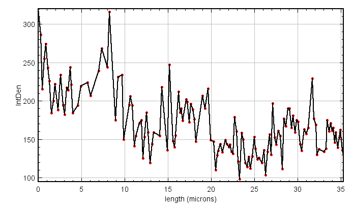

#  BIOIMAGING - INEB/i3S
Eduardo Conde-Sousa (econdesousa@gmail.com)

## Extended Plot Profile

* Runs over all ROIs and get point coordinates
* For each it expands in 3D (image units) and add to 3d manager
* at the end it gets 3d quantif
 
 
### code version
1.0 
	
### last modification
06/09/2021

### Requirements
* update sites (see https://imagej.net/plugins/morpholibj#installation):
	* IJPB-plugins


### Attribution:
If you use this macro please add in the acknowledgements of your papers and/or thesis (MSc and PhD) the reference to Bioimaging and the project PPBI-POCI-01-0145-FEDER-022122.
As a suggestion you may use the following sentence:
 * The authors acknowledge the support of the i3S Scientific Platform Bioimaging, member of the national infrastructure PPBI - Portuguese Platform of Bioimaging (PPBI-POCI-01-0145-FEDER-022122).
 

please cite:
* this macro
* SNT: https://www.nature.com/articles/s41592-021-01105-7
* 3D ImageJ Suite: https://academic.oup.com/bioinformatics/article/29/14/1840/231770


```java
print("\\Clear");
print("neurite radius (in microns)", nRadius);
print("Quantif channel:",quantifChannel);

if (nImages!=1){
	close("*");
	filePath = File.openDialog("open image");
	open(filePath);
}


if (roiManager("count")<1){
	roiPath = File.openDialog("open ROI");
	roiManager("open", roiPath);
}

resetResults();


```
<pre>
> neurite radius (in microns) 5
> Quantif channel: 1
</pre>
<a href="image_1630944764258.png"></a>

# setup

```java
id=getImageID();
main = getTitle();
dir=getDirectory("image");
print("\\Clear");
mainName=substring(main, 0,lastIndexOf(main, "."));


Stack.getDimensions(w, h, c, s, f);
getVoxelSize(width, height, depth, unit);

run("3D Manager");
Ext.Manager3D_SelectAll();
Ext.Manager3D_Delete();


```
<pre>
> First instance of 3D Manager
> Checking installation...
> Java3D not installed. 
> Replacement of Java3D installed. 
> Installation OK
> Starting RoiManager3D
> 1.6
</pre>

# Create tmp mask

```java
setBatchMode(true);
newImage("mask", "8-bit black", getWidth, getHeight(), s);
setVoxelSize(width, height, depth, unit);
maskid=getImageID();


```
<a href="image_1630944767039.png"></a>

# main loop

```java
for (i = 0; i < roiManager("count"); i++) {
	selectImage(id);
	getVoxelSize(width, height, depth, unit);
	roiManager("select", i);
	Stack.getPosition(channel, slice, frame);
	getSelectionCoordinates(xpoints, ypoints);
	print(lengthOf(xpoints));
	for (j = 0; j < lengthOf(xpoints); j++) {
		selectImage(maskid);	
		run("Select All");
		run("Set...", "value=0 stack");
		run("Select None");
		Stack.setSlice(slice);
		setPixel(xpoints[j], ypoints[j], 255);
		expand3Dmeasure(nRadius,maskid,main);
	}
	selectImage(id);
}

```
<pre>
> 19
> Adding image : min-max 255 255
> 1 objects added. Total of 1 objects
> Adding image : min-max 255 255
> 1 objects added. Total of 2 objects
> Adding image : min-max 255 255
> 1 objects added. Total of 3 objects
> Adding image : min-max 255 255
> 1 objects added. Total of 4 objects
> Adding image : min-max 255 255
> 1 objects added. Total of 5 objects
> Adding image : min-max 255 255
> 1 objects added. Total of 6 objects
> Adding image : min-max 255 255
> 1 objects added. Total of 7 objects
> Adding image : min-max 255 255
> 1 objects added. Total of 8 objects
> Adding image : min-max 255 255
> 1 objects added. Total of 9 objects
> Adding image : min-max 255 255
> 1 objects added. Total of 10 objects
> Adding image : min-max 255 255
> 1 objects added. Total of 11 objects
> Adding image : min-max 255 255
> 1 objects added. Total of 12 objects
> Adding image : min-max 255 255
> 1 objects added. Total of 13 objects
> Adding image : min-max 255 255
> 1 objects added. Total of 14 objects
> Adding image : min-max 255 255
> 1 objects added. Total of 15 objects
> Adding image : min-max 255 255
> 1 objects added. Total of 16 objects
> Adding image : min-max 255 255
> 1 objects added. Total of 17 objects
> Adding image : min-max 255 255
> 1 objects added. Total of 18 objects
> Adding image : min-max 255 255
> 1 objects added. Total of 19 objects
> 2
> Adding image : min-max 255 255
> 1 objects added. Total of 20 objects
> Adding image : min-max 255 255
> 1 objects added. Total of 21 objects
> 2
> Adding image : min-max 255 255
> 1 objects added. Total of 22 objects
> Adding image : min-max 255 255
> 1 objects added. Total of 23 objects
> 2
> Adding image : min-max 255 255
> 1 objects added. Total of 24 objects
> Adding image : min-max 255 255
> 1 objects added. Total of 25 objects
> 2
> Adding image : min-max 255 255
> 1 objects added. Total of 26 objects
> Adding image : min-max 255 255
> 1 objects added. Total of 27 objects
> 2
> Adding image : min-max 255 255
> 1 objects added. Total of 28 objects
> Adding image : min-max 255 255
> 1 objects added. Total of 29 objects
> 2
> Adding image : min-max 255 255
> 1 objects added. Total of 30 objects
> Adding image : min-max 255 255
> 1 objects added. Total of 31 objects
> 3
> Adding image : min-max 255 255
> 1 objects added. Total of 32 objects
> Adding image : min-max 255 255
> 1 objects added. Total of 33 objects
> Adding image : min-max 255 255
> 1 objects added. Total of 34 objects
> 2
> Adding image : min-max 255 255
> 1 objects added. Total of 35 objects
> Adding image : min-max 255 255
> 1 objects added. Total of 36 objects
> 9
> Adding image : min-max 255 255
> 1 objects added. Total of 37 objects
> Adding image : min-max 255 255
> 1 objects added. Total of 38 objects
> Adding image : min-max 255 255
> 1 objects added. Total of 39 objects
> Adding image : min-max 255 255
> 1 objects added. Total of 40 objects
> Adding image : min-max 255 255
> 1 objects added. Total of 41 objects
> Adding image : min-max 255 255
> 1 objects added. Total of 42 objects
> Adding image : min-max 255 255
> 1 objects added. Total of 43 objects
> Adding image : min-max 255 255
> 1 objects added. Total of 44 objects
> Adding image : min-max 255 255
> 1 objects added. Total of 45 objects
> 2
> Adding image : min-max 255 255
> 1 objects added. Total of 46 objects
> Adding image : min-max 255 255
> 1 objects added. Total of 47 objects
> 2
> Adding image : min-max 255 255
> 1 objects added. Total of 48 objects
> Adding image : min-max 255 255
> 1 objects added. Total of 49 objects
> 3
> Adding image : min-max 255 255
> 1 objects added. Total of 50 objects
> Adding image : min-max 255 255
> 1 objects added. Total of 51 objects
> Adding image : min-max 255 255
> 1 objects added. Total of 52 objects
> 4
> Adding image : min-max 255 255
> 1 objects added. Total of 53 objects
> Adding image : min-max 255 255
> 1 objects added. Total of 54 objects
> Adding image : min-max 255 255
> 1 objects added. Total of 55 objects
> Adding image : min-max 255 255
> 1 objects added. Total of 56 objects
> 7
> Adding image : min-max 255 255
> 1 objects added. Total of 57 objects
> Adding image : min-max 255 255
> 1 objects added. Total of 58 objects
> Adding image : min-max 255 255
> 1 objects added. Total of 59 objects
> Adding image : min-max 255 255
> 1 objects added. Total of 60 objects
> Adding image : min-max 255 255
> 1 objects added. Total of 61 objects
> Adding image : min-max 255 255
> 1 objects added. Total of 62 objects
> Adding image : min-max 255 255
> 1 objects added. Total of 63 objects
> 2
> Adding image : min-max 255 255
> 1 objects added. Total of 64 objects
> Adding image : min-max 255 255
> 1 objects added. Total of 65 objects
> 2
> Adding image : min-max 255 255
> 1 objects added. Total of 66 objects
> Adding image : min-max 255 255
> 1 objects added. Total of 67 objects
> 6
> Adding image : min-max 255 255
> 1 objects added. Total of 68 objects
> Adding image : min-max 255 255
> 1 objects added. Total of 69 objects
> Adding image : min-max 255 255
> 1 objects added. Total of 70 objects
> Adding image : min-max 255 255
> 1 objects added. Total of 71 objects
> Adding image : min-max 255 255
> 1 objects added. Total of 72 objects
> Adding image : min-max 255 255
> 1 objects added. Total of 73 objects
> 12
> Adding image : min-max 255 255
> 1 objects added. Total of 74 objects
> Adding image : min-max 255 255
> 1 objects added. Total of 75 objects
> Adding image : min-max 255 255
> 1 objects added. Total of 76 objects
> Adding image : min-max 255 255
> 1 objects added. Total of 77 objects
> Adding image : min-max 255 255
> 1 objects added. Total of 78 objects
> Adding image : min-max 255 255
> 1 objects added. Total of 79 objects
> Adding image : min-max 255 255
> 1 objects added. Total of 80 objects
> Adding image : min-max 255 255
> 1 objects added. Total of 81 objects
> Adding image : min-max 255 255
> 1 objects added. Total of 82 objects
> Adding image : min-max 255 255
> 1 objects added. Total of 83 objects
> Adding image : min-max 255 255
> 1 objects added. Total of 84 objects
> Adding image : min-max 255 255
> 1 objects added. Total of 85 objects
> 9
> Adding image : min-max 255 255
> 1 objects added. Total of 86 objects
> Adding image : min-max 255 255
> 1 objects added. Total of 87 objects
> Adding image : min-max 255 255
> 1 objects added. Total of 88 objects
> Adding image : min-max 255 255
> 1 objects added. Total of 89 objects
> Adding image : min-max 255 255
> 1 objects added. Total of 90 objects
> Adding image : min-max 255 255
> 1 objects added. Total of 91 objects
> Adding image : min-max 255 255
> 1 objects added. Total of 92 objects
> Adding image : min-max 255 255
> 1 objects added. Total of 93 objects
> Adding image : min-max 255 255
> 1 objects added. Total of 94 objects
> 26
> Adding image : min-max 255 255
> 1 objects added. Total of 95 objects
> Adding image : min-max 255 255
> 1 objects added. Total of 96 objects
> Adding image : min-max 255 255
> 1 objects added. Total of 97 objects
> Adding image : min-max 255 255
> 1 objects added. Total of 98 objects
> Adding image : min-max 255 255
> 1 objects added. Total of 99 objects
> Adding image : min-max 255 255
> 1 objects added. Total of 100 objects
> Adding image : min-max 255 255
> 1 objects added. Total of 101 objects
> Adding image : min-max 255 255
> 1 objects added. Total of 102 objects
> Adding image : min-max 255 255
> 1 objects added. Total of 103 objects
> Adding image : min-max 255 255
> 1 objects added. Total of 104 objects
> Adding image : min-max 255 255
> 1 objects added. Total of 105 objects
> Adding image : min-max 255 255
> 1 objects added. Total of 106 objects
> Adding image : min-max 255 255
> 1 objects added. Total of 107 objects
> Adding image : min-max 255 255
> 1 objects added. Total of 108 objects
> Adding image : min-max 255 255
> 1 objects added. Total of 109 objects
> Adding image : min-max 255 255
> 1 objects added. Total of 110 objects
> Adding image : min-max 255 255
> 1 objects added. Total of 111 objects
> Adding image : min-max 255 255
> 1 objects added. Total of 112 objects
> Adding image : min-max 255 255
> 1 objects added. Total of 113 objects
> Adding image : min-max 255 255
> 1 objects added. Total of 114 objects
> Adding image : min-max 255 255
> 1 objects added. Total of 115 objects
> Adding image : min-max 255 255
> 1 objects added. Total of 116 objects
> Adding image : min-max 255 255
> 1 objects added. Total of 117 objects
> Adding image : min-max 255 255
> 1 objects added. Total of 118 objects
> Adding image : min-max 255 255
> 1 objects added. Total of 119 objects
> Adding image : min-max 255 255
> 1 objects added. Total of 120 objects
> 5
> Adding image : min-max 255 255
> 1 objects added. Total of 121 objects
> Adding image : min-max 255 255
> 1 objects added. Total of 122 objects
> Adding image : min-max 255 255
> 1 objects added. Total of 123 objects
> Adding image : min-max 255 255
> 1 objects added. Total of 124 objects
> Adding image : min-max 255 255
> 1 objects added. Total of 125 objects
> 14
> Adding image : min-max 255 255
> 1 objects added. Total of 126 objects
> Adding image : min-max 255 255
> 1 objects added. Total of 127 objects
> Adding image : min-max 255 255
> 1 objects added. Total of 128 objects
> Adding image : min-max 255 255
> 1 objects added. Total of 129 objects
> Adding image : min-max 255 255
> 1 objects added. Total of 130 objects
> Adding image : min-max 255 255
> 1 objects added. Total of 131 objects
> Adding image : min-max 255 255
> 1 objects added. Total of 132 objects
> Adding image : min-max 255 255
> 1 objects added. Total of 133 objects
> Adding image : min-max 255 255
> 1 objects added. Total of 134 objects
> Adding image : min-max 255 255
> 1 objects added. Total of 135 objects
> Adding image : min-max 255 255
> 1 objects added. Total of 136 objects
> Adding image : min-max 255 255
> 1 objects added. Total of 137 objects
> Adding image : min-max 255 255
> 1 objects added. Total of 138 objects
> Adding image : min-max 255 255
> 1 objects added. Total of 139 objects
</pre>
<a href="image_1630944869708.png"></a>
<a href="image_1630944869744.png"></a>

# quantifications

```java
selectWindow(main);
Stack.setChannel(quantifChannel);

Ext.Manager3D_SelectAll();
Ext.Manager3D_Quantif();
selectWindow("Log");run("Close");
Ext.Manager3D_SaveResult("Q",dir+mainName+"_Results3D.csv");
Ext.Manager3D_CloseResult("Q");
Ext.Manager3D_Close();
selectWindow("Log");run("Close");

open(dir+"Q_"+mainName+"_Results3D.csv");


x=Table.getColumn("CMx (unit)");
y=Table.getColumn("CMy (unit)");
z=Table.getColumn("CMz (unit)");
Table.set("length (unit)", 0, 0);
Table.set("lengthAccumulated (unit)", 0, 0);
distTotal=0;
for (i = 1; i < lengthOf(x); i++) {
	dist=sqrt(pow(x[i-1]-x[i],2)+pow(y[i-1]-y[i], 2)+pow(z[i-1]-z[i], 2));
	Table.set("length (unit)", i, dist);
	distTotal = distTotal + dist;
	Table.set("lengthAccumulated (unit)", i, distTotal);
}

Table.save(dir+mainName+"_Results3D_ch_"+quantifChannel+".tsv");
Table.rename("Results");
File.delete(dir+"Q_"+mainName+"_Results3D.csv");
print("\\Clear");selectWindow("Log");run("Close");


```
<a href="image_1630944871469.png"></a>
<table>
<tr><th>Nb</th><th>Name</th><th>Label</th><th>Type</th><th>AtCenter</th><th>CMx (pix)</th><th>CMy (pix)</th><th>CMz (pix)</th><th>CMx (unit)</th><th>CMy (unit)</th><th>CMz (unit)</th><th>IntDen</th><th>Min</th><th>Max</th><th>Mean</th><th>Sigma</th><th>length (unit)</th><th>lengthAccumulated (unit)</th></tr>
<tr><td>0</td><td>obj1-val255</td><td>255</td><td>0</td><td>119</td><td>258</td><td>261</td><td>97.188</td><td>37.229</td><td>37.662</td><td>44.721</td><td>320</td><td>17</td><td>119</td><td>64.000</td><td>37.829</td><td>0.000</td><td>0.000</td></tr>
<tr><td>1</td><td>obj2-val255</td><td>255</td><td>0</td><td>80</td><td>257</td><td>260</td><td>96.745</td><td>37.085</td><td>37.518</td><td>44.517</td><td>286</td><td>31</td><td>89</td><td>57.200</td><td>25.607</td><td>0.288</td><td>0.288</td></tr>
<tr><td>2</td><td>obj3-val255</td><td>255</td><td>0</td><td>56</td><td>256</td><td>259</td><td>96.637</td><td>36.941</td><td>37.374</td><td>44.467</td><td>215</td><td>15</td><td>72</td><td>43.000</td><td>21.749</td><td>0.210</td><td>0.498</td></tr>
<tr><td>3</td><td>obj4-val255</td><td>255</td><td>0</td><td>53</td><td>255</td><td>259</td><td>96.361</td><td>36.797</td><td>37.374</td><td>44.340</td><td>255</td><td>13</td><td>93</td><td>51.000</td><td>30.586</td><td>0.192</td><td>0.691</td></tr>
<tr><td>4</td><td>obj5-val255</td><td>255</td><td>0</td><td>73</td><td>254</td><td>258</td><td>96.219</td><td>36.652</td><td>37.229</td><td>44.275</td><td>274</td><td>7</td><td>85</td><td>54.800</td><td>36.293</td><td>0.214</td><td>0.905</td></tr>
<tr><td>5</td><td>obj6-val255</td><td>255</td><td>0</td><td>61</td><td>253</td><td>257</td><td>96.272</td><td>36.508</td><td>37.085</td><td>44.299</td><td>243</td><td>11</td><td>82</td><td>48.600</td><td>28.850</td><td>0.206</td><td>1.110</td></tr>
<tr><td>6</td><td>obj7-val255</td><td>255</td><td>0</td><td>58</td><td>252</td><td>256</td><td>96.310</td><td>36.364</td><td>36.941</td><td>44.317</td><td>226</td><td>13</td><td>79</td><td>45.200</td><td>26.148</td><td>0.205</td><td>1.315</td></tr>
<tr><td>7</td><td>obj8-val255</td><td>255</td><td>0</td><td>48</td><td>251</td><td>256</td><td>96.658</td><td>36.219</td><td>36.941</td><td>44.477</td><td>184</td><td>16</td><td>48</td><td>36.800</td><td>12.677</td><td>0.216</td><td>1.531</td></tr>
<tr><td>8</td><td>obj9-val255</td><td>255</td><td>0</td><td>39</td><td>250</td><td>255</td><td>96.805</td><td>36.075</td><td>36.797</td><td>44.545</td><td>200</td><td>29</td><td>50</td><td>40.000</td><td>7.778</td><td>0.215</td><td>1.746</td></tr>
<tr><td>9</td><td>obj10-val255</td><td>255</td><td>0</td><td>50</td><td>249</td><td>255</td><td>97.140</td><td>35.931</td><td>36.797</td><td>44.699</td><td>222</td><td>36</td><td>57</td><td>44.400</td><td>8.961</td><td>0.211</td><td>1.957</td></tr>
<tr><td>10</td><td>obj11-val255</td><td>255</td><td>0</td><td>51</td><td>248</td><td>254</td><td>96.590</td><td>35.786</td><td>36.652</td><td>44.446</td><td>188</td><td>20</td><td>56</td><td>37.600</td><td>15.339</td><td>0.325</td><td>2.282</td></tr>
<tr><td>11</td><td>obj12-val255</td><td>255</td><td>0</td><td>48</td><td>247</td><td>253</td><td>96.124</td><td>35.642</td><td>36.508</td><td>44.231</td><td>234</td><td>14</td><td>97</td><td>46.800</td><td>33.656</td><td>0.296</td><td>2.578</td></tr>
<tr><td>12</td><td>obj13-val255</td><td>255</td><td>0</td><td>47</td><td>246</td><td>252</td><td>96.595</td><td>35.498</td><td>36.364</td><td>44.448</td><td>195</td><td>8</td><td>49</td><td>39.000</td><td>17.421</td><td>0.298</td><td>2.876</td></tr>
<tr><td>13</td><td>obj14-val255</td><td>255</td><td>0</td><td>49</td><td>245</td><td>251</td><td>96.632</td><td>35.354</td><td>36.219</td><td>44.465</td><td>182</td><td>13</td><td>60</td><td>36.400</td><td>18.352</td><td>0.205</td><td>3.080</td></tr>
<tr><td>14</td><td>obj15-val255</td><td>255</td><td>0</td><td>67</td><td>244</td><td>251</td><td>96.373</td><td>35.209</td><td>36.219</td><td>44.346</td><td>217</td><td>11</td><td>72</td><td>43.400</td><td>28.431</td><td>0.187</td><td>3.267</td></tr>
<tr><td>15</td><td>obj16-val255</td><td>255</td><td>0</td><td>63</td><td>243</td><td>250</td><td>96.435</td><td>35.065</td><td>36.075</td><td>44.374</td><td>214</td><td>15</td><td>63</td><td>42.800</td><td>22.499</td><td>0.206</td><td>3.473</td></tr>
<tr><td>16</td><td>obj17-val255</td><td>255</td><td>0</td><td>59</td><td>242</td><td>249</td><td>96.541</td><td>34.921</td><td>35.931</td><td>44.423</td><td>244</td><td>11</td><td>76</td><td>48.800</td><td>23.931</td><td>0.210</td><td>3.683</td></tr>
<tr><td>17</td><td>obj18-val255</td><td>255</td><td>0</td><td>59</td><td>241</td><td>249</td><td>96.584</td><td>34.776</td><td>35.931</td><td>44.443</td><td>221</td><td>13</td><td>69</td><td>44.200</td><td>21.568</td><td>0.146</td><td>3.829</td></tr>
<tr><td>18</td><td>obj19-val255</td><td>255</td><td>0</td><td>43</td><td>240</td><td>249</td><td>96.288</td><td>34.632</td><td>35.931</td><td>44.307</td><td>184</td><td>7</td><td>63</td><td>36.800</td><td>22.895</td><td>0.198</td><td>4.027</td></tr>
<tr><td>19</td><td>obj20-val255</td><td>255</td><td>0</td><td>32</td><td>239</td><td>248</td><td>95.134</td><td>34.488</td><td>35.786</td><td>43.776</td><td>194</td><td>5</td><td>85</td><td>38.800</td><td>31.862</td><td>0.569</td><td>4.596</td></tr>
<tr><td>20</td><td>obj21-val255</td><td>255</td><td>0</td><td>63</td><td>240</td><td>249</td><td>95.763</td><td>34.632</td><td>35.931</td><td>44.065</td><td>219</td><td>20</td><td>63</td><td>43.800</td><td>15.738</td><td>0.354</td><td>4.950</td></tr>
<tr><td>21</td><td>obj22-val255</td><td>255</td><td>0</td><td>57</td><td>238</td><td>247</td><td>94.321</td><td>34.343</td><td>35.642</td><td>43.402</td><td>224</td><td>7</td><td>88</td><td>44.800</td><td>31.586</td><td>0.779</td><td>5.729</td></tr>
<tr><td>22</td><td>obj23-val255</td><td>255</td><td>0</td><td>85</td><td>239</td><td>248</td><td>94.879</td><td>34.488</td><td>35.786</td><td>43.659</td><td>207</td><td>17</td><td>85</td><td>41.400</td><td>28.798</td><td>0.328</td><td>6.057</td></tr>
<tr><td>23</td><td>obj24-val255</td><td>255</td><td>0</td><td>39</td><td>237</td><td>246</td><td>93.096</td><td>34.199</td><td>35.498</td><td>42.838</td><td>239</td><td>17</td><td>109</td><td>47.800</td><td>37.138</td><td>0.916</td><td>6.973</td></tr>
<tr><td>24</td><td>obj25-val255</td><td>255</td><td>0</td><td>88</td><td>238</td><td>247</td><td>93.810</td><td>34.343</td><td>35.642</td><td>43.166</td><td>268</td><td>22</td><td>88</td><td>53.600</td><td>23.522</td><td>0.387</td><td>7.360</td></tr>
<tr><td>25</td><td>obj26-val255</td><td>255</td><td>0</td><td>41</td><td>236</td><td>246</td><td>92.533</td><td>34.055</td><td>35.498</td><td>42.579</td><td>244</td><td>21</td><td>91</td><td>48.800</td><td>26.081</td><td>0.670</td><td>8.030</td></tr>
<tr><td>26</td><td>obj27-val255</td><td>255</td><td>0</td><td>56</td><td>237</td><td>247</td><td>92.655</td><td>34.199</td><td>35.642</td><td>42.635</td><td>316</td><td>27</td><td>102</td><td>63.200</td><td>26.846</td><td>0.212</td><td>8.242</td></tr>
<tr><td>27</td><td>obj28-val255</td><td>255</td><td>0</td><td>51</td><td>235</td><td>246</td><td>91.360</td><td>33.911</td><td>35.498</td><td>42.039</td><td>175</td><td>11</td><td>56</td><td>35.000</td><td>21.806</td><td>0.678</td><td>8.919</td></tr>
<tr><td>28</td><td>obj29-val255</td><td>255</td><td>0</td><td>64</td><td>236</td><td>247</td><td>91.896</td><td>34.055</td><td>35.642</td><td>42.286</td><td>231</td><td>34</td><td>64</td><td>46.200</td><td>13.405</td><td>0.320</td><td>9.239</td></tr>
<tr><td>29</td><td>obj30-val255</td><td>255</td><td>0</td><td>49</td><td>235</td><td>247</td><td>90.880</td><td>33.911</td><td>35.642</td><td>41.818</td><td>234</td><td>34</td><td>68</td><td>46.800</td><td>13.027</td><td>0.489</td><td>9.729</td></tr>
<tr><td>30</td><td>obj31-val255</td><td>255</td><td>0</td><td>30</td><td>234</td><td>247</td><td>90.793</td><td>33.766</td><td>35.642</td><td>41.778</td><td>150</td><td>20</td><td>41</td><td>30.000</td><td>7.649</td><td>0.150</td><td>9.878</td></tr>
<tr><td>31</td><td>obj32-val255</td><td>255</td><td>0</td><td>68</td><td>233</td><td>248</td><td>89.477</td><td>33.622</td><td>35.786</td><td>41.173</td><td>195</td><td>14</td><td>68</td><td>39.000</td><td>22.978</td><td>0.639</td><td>10.517</td></tr>
<tr><td>32</td><td>obj33-val255</td><td>255</td><td>0</td><td>76</td><td>232</td><td>248</td><td>89.432</td><td>33.478</td><td>35.786</td><td>41.152</td><td>206</td><td>5</td><td>76</td><td>41.200</td><td>27.344</td><td>0.146</td><td>10.663</td></tr>
<tr><td>33</td><td>obj34-val255</td><td>255</td><td>0</td><td>55</td><td>231</td><td>248</td><td>89.134</td><td>33.333</td><td>35.786</td><td>41.015</td><td>194</td><td>6</td><td>68</td><td>38.800</td><td>30.310</td><td>0.199</td><td>10.862</td></tr>
<tr><td>34</td><td>obj35-val255</td><td>255</td><td>0</td><td>47</td><td>230</td><td>247</td><td>88.759</td><td>33.189</td><td>35.642</td><td>40.842</td><td>141</td><td>10</td><td>47</td><td>28.200</td><td>13.480</td><td>0.267</td><td>11.130</td></tr>
<tr><td>35</td><td>obj36-val255</td><td>255</td><td>0</td><td>53</td><td>229</td><td>247</td><td>88.636</td><td>33.045</td><td>35.642</td><td>40.786</td><td>154</td><td>17</td><td>53</td><td>30.800</td><td>15.595</td><td>0.155</td><td>11.285</td></tr>
<tr><td>36</td><td>obj37-val255</td><td>255</td><td>0</td><td>63</td><td>228</td><td>246</td><td>87.836</td><td>32.900</td><td>35.498</td><td>40.418</td><td>171</td><td>12</td><td>63</td><td>34.200</td><td>18.647</td><td>0.421</td><td>11.705</td></tr>
<tr><td>37</td><td>obj38-val255</td><td>255</td><td>0</td><td>55</td><td>227</td><td>245</td><td>87.634</td><td>32.756</td><td>35.354</td><td>40.325</td><td>175</td><td>15</td><td>55</td><td>35.000</td><td>15.937</td><td>0.224</td><td>11.930</td></tr>
<tr><td>38</td><td>obj39-val255</td><td>255</td><td>0</td><td>40</td><td>226</td><td>244</td><td>87.648</td><td>32.612</td><td>35.209</td><td>40.331</td><td>125</td><td>9</td><td>40</td><td>25.000</td><td>12.062</td><td>0.204</td><td>12.134</td></tr>
<tr><td>39</td><td>obj40-val255</td><td>255</td><td>0</td><td>48</td><td>225</td><td>244</td><td>87.471</td><td>32.468</td><td>35.209</td><td>40.249</td><td>153</td><td>6</td><td>48</td><td>30.600</td><td>17.024</td><td>0.166</td><td>12.300</td></tr>
<tr><td>40</td><td>obj41-val255</td><td>255</td><td>0</td><td>59</td><td>224</td><td>243</td><td>87.438</td><td>32.323</td><td>35.065</td><td>40.234</td><td>185</td><td>7</td><td>59</td><td>37.000</td><td>21.059</td><td>0.205</td><td>12.504</td></tr>
<tr><td>41</td><td>obj42-val255</td><td>255</td><td>0</td><td>47</td><td>224</td><td>242</td><td>87.692</td><td>32.323</td><td>34.921</td><td>40.351</td><td>159</td><td>19</td><td>47</td><td>31.800</td><td>12.071</td><td>0.186</td><td>12.690</td></tr>
<tr><td>42</td><td>obj43-val255</td><td>255</td><td>0</td><td>41</td><td>223</td><td>241</td><td>87.992</td><td>32.179</td><td>34.776</td><td>40.489</td><td>119</td><td>16</td><td>41</td><td>23.800</td><td>10.134</td><td>0.246</td><td>12.936</td></tr>
<tr><td>43</td><td>obj44-val255</td><td>255</td><td>0</td><td>27</td><td>222</td><td>240</td><td>87.660</td><td>32.035</td><td>34.632</td><td>40.336</td><td>144</td><td>11</td><td>48</td><td>28.800</td><td>13.198</td><td>0.255</td><td>13.191</td></tr>
<tr><td>44</td><td>obj45-val255</td><td>255</td><td>0</td><td>28</td><td>222</td><td>239</td><td>87.566</td><td>32.035</td><td>34.488</td><td>40.293</td><td>159</td><td>18</td><td>47</td><td>31.800</td><td>12.637</td><td>0.151</td><td>13.342</td></tr>
<tr><td>45</td><td>obj46-val255</td><td>255</td><td>0</td><td>34</td><td>220</td><td>237</td><td>86.286</td><td>31.746</td><td>34.199</td><td>39.704</td><td>154</td><td>9</td><td>51</td><td>30.800</td><td>17.556</td><td>0.717</td><td>14.059</td></tr>
<tr><td>46</td><td>obj47-val255</td><td>255</td><td>0</td><td>59</td><td>221</td><td>238</td><td>86.633</td><td>31.890</td><td>34.343</td><td>39.864</td><td>218</td><td>17</td><td>65</td><td>43.600</td><td>19.230</td><td>0.259</td><td>14.318</td></tr>
<tr><td>47</td><td>obj48-val255</td><td>255</td><td>0</td><td>31</td><td>219</td><td>237</td><td>85.500</td><td>31.602</td><td>34.199</td><td>39.343</td><td>136</td><td>8</td><td>56</td><td>27.200</td><td>18.130</td><td>0.613</td><td>14.931</td></tr>
<tr><td>48</td><td>obj49-val255</td><td>255</td><td>0</td><td>72</td><td>220</td><td>238</td><td>85.785</td><td>31.746</td><td>34.343</td><td>39.474</td><td>247</td><td>24</td><td>72</td><td>49.400</td><td>17.024</td><td>0.243</td><td>15.174</td></tr>
<tr><td>49</td><td>obj50-val255</td><td>255</td><td>0</td><td>56</td><td>219</td><td>237</td><td>85.027</td><td>31.602</td><td>34.199</td><td>39.125</td><td>148</td><td>18</td><td>56</td><td>29.600</td><td>15.566</td><td>0.404</td><td>15.578</td></tr>
<tr><td>50</td><td>obj51-val255</td><td>255</td><td>0</td><td>49</td><td>218</td><td>237</td><td>84.829</td><td>31.457</td><td>34.199</td><td>39.034</td><td>140</td><td>16</td><td>49</td><td>28.000</td><td>12.450</td><td>0.171</td><td>15.749</td></tr>
<tr><td>51</td><td>obj52-val255</td><td>255</td><td>0</td><td>50</td><td>217</td><td>237</td><td>84.742</td><td>31.313</td><td>34.199</td><td>38.994</td><td>155</td><td>14</td><td>50</td><td>31.000</td><td>15.604</td><td>0.150</td><td>15.898</td></tr>
<tr><td>52</td><td>obj53-val255</td><td>255</td><td>0</td><td>77</td><td>216</td><td>237</td><td>84.118</td><td>31.169</td><td>34.199</td><td>38.707</td><td>212</td><td>25</td><td>77</td><td>42.400</td><td>21.396</td><td>0.321</td><td>16.220</td></tr>
<tr><td>53</td><td>obj54-val255</td><td>255</td><td>0</td><td>67</td><td>215</td><td>237</td><td>83.924</td><td>31.025</td><td>34.199</td><td>38.618</td><td>185</td><td>22</td><td>67</td><td>37.000</td><td>17.507</td><td>0.170</td><td>16.389</td></tr>
<tr><td>54</td><td>obj55-val255</td><td>255</td><td>0</td><td>74</td><td>214</td><td>237</td><td>83.789</td><td>30.880</td><td>34.199</td><td>38.556</td><td>190</td><td>13</td><td>74</td><td>38.000</td><td>22.282</td><td>0.157</td><td>16.546</td></tr>
<tr><td>55</td><td>obj56-val255</td><td>255</td><td>0</td><td>75</td><td>213</td><td>237</td><td>83.592</td><td>30.736</td><td>34.199</td><td>38.465</td><td>174</td><td>8</td><td>75</td><td>34.800</td><td>25.801</td><td>0.171</td><td>16.717</td></tr>
<tr><td>56</td><td>obj57-val255</td><td>255</td><td>0</td><td>82</td><td>212</td><td>236</td><td>82.856</td><td>30.592</td><td>34.055</td><td>38.126</td><td>202</td><td>13</td><td>82</td><td>40.400</td><td>25.540</td><td>0.395</td><td>17.112</td></tr>
<tr><td>57</td><td>obj58-val255</td><td>255</td><td>0</td><td>93</td><td>211</td><td>236</td><td>82.754</td><td>30.447</td><td>34.055</td><td>38.079</td><td>199</td><td>11</td><td>93</td><td>39.800</td><td>31.964</td><td>0.152</td><td>17.264</td></tr>
<tr><td>58</td><td>obj59-val255</td><td>255</td><td>0</td><td>57</td><td>210</td><td>235</td><td>82.855</td><td>30.303</td><td>33.911</td><td>38.125</td><td>172</td><td>9</td><td>57</td><td>34.400</td><td>18.325</td><td>0.209</td><td>17.473</td></tr>
<tr><td>59</td><td>obj60-val255</td><td>255</td><td>0</td><td>57</td><td>209</td><td>234</td><td>82.862</td><td>30.159</td><td>33.766</td><td>38.129</td><td>196</td><td>24</td><td>57</td><td>39.200</td><td>12.357</td><td>0.204</td><td>17.677</td></tr>
<tr><td>60</td><td>obj61-val255</td><td>255</td><td>0</td><td>65</td><td>208</td><td>233</td><td>82.735</td><td>30.014</td><td>33.622</td><td>38.071</td><td>189</td><td>16</td><td>65</td><td>37.800</td><td>19.614</td><td>0.212</td><td>17.889</td></tr>
<tr><td>61</td><td>obj62-val255</td><td>255</td><td>0</td><td>78</td><td>207</td><td>233</td><td>82.773</td><td>29.870</td><td>33.622</td><td>38.088</td><td>176</td><td>10</td><td>78</td><td>35.200</td><td>25.440</td><td>0.145</td><td>18.035</td></tr>
<tr><td>62</td><td>obj63-val255</td><td>255</td><td>0</td><td>46</td><td>206</td><td>232</td><td>82.789</td><td>29.726</td><td>33.478</td><td>38.095</td><td>147</td><td>13</td><td>46</td><td>29.400</td><td>13.390</td><td>0.204</td><td>18.239</td></tr>
<tr><td>63</td><td>obj64-val255</td><td>255</td><td>0</td><td>54</td><td>204</td><td>230</td><td>81.411</td><td>29.437</td><td>33.189</td><td>37.461</td><td>207</td><td>11</td><td>68</td><td>41.400</td><td>23.277</td><td>0.754</td><td>18.993</td></tr>
<tr><td>64</td><td>obj65-val255</td><td>255</td><td>0</td><td>56</td><td>205</td><td>231</td><td>81.811</td><td>29.582</td><td>33.333</td><td>37.645</td><td>190</td><td>19</td><td>56</td><td>38.000</td><td>16.416</td><td>0.275</td><td>19.268</td></tr>
<tr><td>65</td><td>obj66-val255</td><td>255</td><td>0</td><td>74</td><td>204</td><td>231</td><td>81.009</td><td>29.437</td><td>33.333</td><td>37.276</td><td>216</td><td>27</td><td>74</td><td>43.200</td><td>18.794</td><td>0.396</td><td>19.664</td></tr>
<tr><td>66</td><td>obj67-val255</td><td>255</td><td>0</td><td>56</td><td>203</td><td>230</td><td>80.530</td><td>29.293</td><td>33.189</td><td>37.056</td><td>149</td><td>10</td><td>56</td><td>29.800</td><td>18.526</td><td>0.300</td><td>19.964</td></tr>
<tr><td>67</td><td>obj68-val255</td><td>255</td><td>0</td><td>45</td><td>202</td><td>229</td><td>80.007</td><td>29.149</td><td>33.045</td><td>36.815</td><td>147</td><td>21</td><td>45</td><td>29.400</td><td>9.915</td><td>0.316</td><td>20.280</td></tr>
<tr><td>68</td><td>obj69-val255</td><td>255</td><td>0</td><td>43</td><td>201</td><td>228</td><td>79.809</td><td>29.004</td><td>32.900</td><td>36.724</td><td>110</td><td>8</td><td>43</td><td>22.000</td><td>16.416</td><td>0.223</td><td>20.504</td></tr>
<tr><td>69</td><td>obj70-val255</td><td>255</td><td>0</td><td>47</td><td>200</td><td>227</td><td>79.829</td><td>28.860</td><td>32.756</td><td>36.733</td><td>129</td><td>9</td><td>47</td><td>25.800</td><td>17.079</td><td>0.204</td><td>20.708</td></tr>
<tr><td>70</td><td>obj71-val255</td><td>255</td><td>0</td><td>51</td><td>200</td><td>226</td><td>79.852</td><td>28.860</td><td>32.612</td><td>36.744</td><td>135</td><td>8</td><td>51</td><td>27.000</td><td>15.764</td><td>0.145</td><td>20.852</td></tr>
<tr><td>71</td><td>obj72-val255</td><td>255</td><td>0</td><td>51</td><td>199</td><td>225</td><td>79.792</td><td>28.716</td><td>32.468</td><td>36.716</td><td>144</td><td>8</td><td>51</td><td>28.800</td><td>18.171</td><td>0.206</td><td>21.058</td></tr>
<tr><td>72</td><td>obj73-val255</td><td>255</td><td>0</td><td>31</td><td>198</td><td>224</td><td>79.669</td><td>28.571</td><td>32.323</td><td>36.660</td><td>133</td><td>13</td><td>33</td><td>26.600</td><td>8.019</td><td>0.212</td><td>21.270</td></tr>
<tr><td>73</td><td>obj74-val255</td><td>255</td><td>0</td><td>47</td><td>197</td><td>224</td><td>78.966</td><td>28.427</td><td>32.323</td><td>36.336</td><td>149</td><td>19</td><td>47</td><td>29.800</td><td>12.357</td><td>0.354</td><td>21.624</td></tr>
<tr><td>74</td><td>obj75-val255</td><td>255</td><td>0</td><td>50</td><td>196</td><td>223</td><td>78.882</td><td>28.283</td><td>32.179</td><td>36.297</td><td>144</td><td>20</td><td>50</td><td>28.800</td><td>12.317</td><td>0.208</td><td>21.832</td></tr>
<tr><td>75</td><td>obj76-val255</td><td>255</td><td>0</td><td>60</td><td>195</td><td>222</td><td>78.729</td><td>28.139</td><td>32.035</td><td>36.227</td><td>140</td><td>6</td><td>60</td><td>28.000</td><td>19.660</td><td>0.216</td><td>22.048</td></tr>
<tr><td>76</td><td>obj77-val255</td><td>255</td><td>0</td><td>49</td><td>194</td><td>222</td><td>78.755</td><td>27.994</td><td>32.035</td><td>36.239</td><td>143</td><td>12</td><td>49</td><td>28.600</td><td>15.010</td><td>0.145</td><td>22.193</td></tr>
<tr><td>77</td><td>obj78-val255</td><td>255</td><td>0</td><td>38</td><td>193</td><td>222</td><td>78.604</td><td>27.850</td><td>32.035</td><td>36.170</td><td>134</td><td>6</td><td>43</td><td>26.800</td><td>14.516</td><td>0.160</td><td>22.353</td></tr>
<tr><td>78</td><td>obj79-val255</td><td>255</td><td>0</td><td>48</td><td>192</td><td>221</td><td>78.649</td><td>27.706</td><td>31.890</td><td>36.190</td><td>131</td><td>7</td><td>48</td><td>26.200</td><td>18.499</td><td>0.205</td><td>22.558</td></tr>
<tr><td>79</td><td>obj80-val255</td><td>255</td><td>0</td><td>54</td><td>191</td><td>221</td><td>78.536</td><td>27.561</td><td>31.890</td><td>36.138</td><td>179</td><td>12</td><td>68</td><td>35.800</td><td>24.232</td><td>0.153</td><td>22.711</td></tr>
<tr><td>80</td><td>obj81-val255</td><td>255</td><td>0</td><td>62</td><td>190</td><td>220</td><td>78.700</td><td>27.417</td><td>31.746</td><td>36.214</td><td>160</td><td>14</td><td>62</td><td>32.000</td><td>18.426</td><td>0.218</td><td>22.929</td></tr>
<tr><td>81</td><td>obj82-val255</td><td>255</td><td>0</td><td>46</td><td>189</td><td>219</td><td>78.826</td><td>27.273</td><td>31.602</td><td>36.272</td><td>121</td><td>9</td><td>46</td><td>24.200</td><td>13.664</td><td>0.212</td><td>23.141</td></tr>
<tr><td>82</td><td>obj83-val255</td><td>255</td><td>0</td><td>30</td><td>188</td><td>219</td><td>79.000</td><td>27.128</td><td>31.602</td><td>36.352</td><td>98</td><td>12</td><td>30</td><td>19.600</td><td>6.731</td><td>0.165</td><td>23.306</td></tr>
<tr><td>83</td><td>obj84-val255</td><td>255</td><td>0</td><td>38</td><td>187</td><td>218</td><td>78.728</td><td>26.984</td><td>31.457</td><td>36.226</td><td>158</td><td>21</td><td>50</td><td>31.600</td><td>12.422</td><td>0.239</td><td>23.545</td></tr>
<tr><td>84</td><td>obj85-val255</td><td>255</td><td>0</td><td>45</td><td>186</td><td>218</td><td>78.727</td><td>26.840</td><td>31.457</td><td>36.226</td><td>150</td><td>8</td><td>45</td><td>30.000</td><td>14.124</td><td>0.144</td><td>23.690</td></tr>
<tr><td>85</td><td>obj86-val255</td><td>255</td><td>0</td><td>36</td><td>185</td><td>217</td><td>78.403</td><td>26.696</td><td>31.313</td><td>36.077</td><td>119</td><td>11</td><td>36</td><td>23.800</td><td>10.964</td><td>0.253</td><td>23.942</td></tr>
<tr><td>86</td><td>obj87-val255</td><td>255</td><td>0</td><td>39</td><td>184</td><td>216</td><td>78.123</td><td>26.551</td><td>31.169</td><td>35.948</td><td>114</td><td>6</td><td>43</td><td>22.800</td><td>16.976</td><td>0.241</td><td>24.184</td></tr>
<tr><td>87</td><td>obj88-val255</td><td>255</td><td>0</td><td>31</td><td>184</td><td>215</td><td>77.937</td><td>26.551</td><td>31.025</td><td>35.863</td><td>127</td><td>11</td><td>35</td><td>25.400</td><td>11.524</td><td>0.168</td><td>24.351</td></tr>
<tr><td>88</td><td>obj89-val255</td><td>255</td><td>0</td><td>33</td><td>183</td><td>214</td><td>78.036</td><td>26.407</td><td>30.880</td><td>35.908</td><td>112</td><td>15</td><td>33</td><td>22.400</td><td>7.436</td><td>0.209</td><td>24.560</td></tr>
<tr><td>89</td><td>obj90-val255</td><td>255</td><td>0</td><td>38</td><td>182</td><td>213</td><td>77.898</td><td>26.263</td><td>30.736</td><td>35.845</td><td>128</td><td>10</td><td>40</td><td>25.600</td><td>14.398</td><td>0.214</td><td>24.774</td></tr>
<tr><td>90</td><td>obj91-val255</td><td>255</td><td>0</td><td>32</td><td>181</td><td>212</td><td>77.843</td><td>26.118</td><td>30.592</td><td>35.819</td><td>153</td><td>20</td><td>36</td><td>30.600</td><td>6.387</td><td>0.206</td><td>24.980</td></tr>
<tr><td>91</td><td>obj92-val255</td><td>255</td><td>0</td><td>38</td><td>180</td><td>212</td><td>77.667</td><td>25.974</td><td>30.592</td><td>35.738</td><td>138</td><td>10</td><td>39</td><td>27.600</td><td>11.803</td><td>0.166</td><td>25.145</td></tr>
<tr><td>92</td><td>obj93-val255</td><td>255</td><td>0</td><td>30</td><td>179</td><td>212</td><td>77.903</td><td>25.830</td><td>30.592</td><td>35.847</td><td>124</td><td>15</td><td>39</td><td>24.800</td><td>9.859</td><td>0.181</td><td>25.326</td></tr>
<tr><td>93</td><td>obj94-val255</td><td>255</td><td>0</td><td>41</td><td>178</td><td>212</td><td>77.683</td><td>25.685</td><td>30.592</td><td>35.745</td><td>126</td><td>8</td><td>42</td><td>25.200</td><td>15.418</td><td>0.176</td><td>25.502</td></tr>
<tr><td>94</td><td>obj95-val255</td><td>255</td><td>0</td><td>45</td><td>177</td><td>211</td><td>78.361</td><td>25.541</td><td>30.447</td><td>36.058</td><td>119</td><td>5</td><td>45</td><td>23.800</td><td>17.627</td><td>0.373</td><td>25.876</td></tr>
<tr><td>95</td><td>obj96-val255</td><td>255</td><td>0</td><td>48</td><td>177</td><td>210</td><td>78.735</td><td>25.541</td><td>30.303</td><td>36.230</td><td>136</td><td>5</td><td>48</td><td>27.200</td><td>17.992</td><td>0.225</td><td>26.100</td></tr>
<tr><td>96</td><td>obj97-val255</td><td>255</td><td>0</td><td>44</td><td>176</td><td>209</td><td>78.883</td><td>25.397</td><td>30.159</td><td>36.298</td><td>103</td><td>7</td><td>44</td><td>20.600</td><td>14.223</td><td>0.215</td><td>26.315</td></tr>
<tr><td>97</td><td>obj98-val255</td><td>255</td><td>0</td><td>32</td><td>175</td><td>208</td><td>79.142</td><td>25.253</td><td>30.014</td><td>36.417</td><td>134</td><td>18</td><td>32</td><td>26.800</td><td>5.263</td><td>0.236</td><td>26.551</td></tr>
<tr><td>98</td><td>obj99-val255</td><td>255</td><td>0</td><td>41</td><td>174</td><td>207</td><td>79.038</td><td>25.108</td><td>29.870</td><td>36.369</td><td>156</td><td>19</td><td>45</td><td>31.200</td><td>11.189</td><td>0.210</td><td>26.761</td></tr>
<tr><td>99</td><td>obj100-val255</td><td>255</td><td>0</td><td>58</td><td>173</td><td>206</td><td>78.946</td><td>24.964</td><td>29.726</td><td>36.327</td><td>130</td><td>9</td><td>58</td><td>26.000</td><td>19.962</td><td>0.208</td><td>26.969</td></tr>
<tr><td>100</td><td>obj101-val255</td><td>255</td><td>0</td><td>69</td><td>172</td><td>206</td><td>78.970</td><td>24.820</td><td>29.726</td><td>36.338</td><td>197</td><td>21</td><td>69</td><td>39.400</td><td>19.360</td><td>0.145</td><td>27.114</td></tr>
<tr><td>101</td><td>obj102-val255</td><td>255</td><td>0</td><td>28</td><td>171</td><td>205</td><td>78.750</td><td>24.675</td><td>29.582</td><td>36.237</td><td>152</td><td>14</td><td>43</td><td>30.400</td><td>12.219</td><td>0.228</td><td>27.342</td></tr>
<tr><td>102</td><td>obj103-val255</td><td>255</td><td>0</td><td>49</td><td>170</td><td>204</td><td>78.769</td><td>24.531</td><td>29.437</td><td>36.246</td><td>143</td><td>8</td><td>49</td><td>28.600</td><td>14.673</td><td>0.204</td><td>27.546</td></tr>
<tr><td>103</td><td>obj104-val255</td><td>255</td><td>0</td><td>50</td><td>169</td><td>203</td><td>78.888</td><td>24.387</td><td>29.293</td><td>36.300</td><td>161</td><td>16</td><td>50</td><td>32.200</td><td>13.989</td><td>0.211</td><td>27.757</td></tr>
<tr><td>104</td><td>obj105-val255</td><td>255</td><td>0</td><td>45</td><td>168</td><td>202</td><td>78.643</td><td>24.242</td><td>29.149</td><td>36.187</td><td>154</td><td>14</td><td>53</td><td>30.800</td><td>17.225</td><td>0.233</td><td>27.991</td></tr>
<tr><td>105</td><td>obj106-val255</td><td>255</td><td>0</td><td>28</td><td>167</td><td>201</td><td>78.874</td><td>24.098</td><td>29.004</td><td>36.294</td><td>111</td><td>12</td><td>29</td><td>22.200</td><td>7.396</td><td>0.230</td><td>28.221</td></tr>
<tr><td>106</td><td>obj107-val255</td><td>255</td><td>0</td><td>36</td><td>166</td><td>200</td><td>78.932</td><td>23.954</td><td>28.860</td><td>36.321</td><td>177</td><td>12</td><td>61</td><td>35.400</td><td>17.729</td><td>0.206</td><td>28.427</td></tr>
<tr><td>107</td><td>obj108-val255</td><td>255</td><td>0</td><td>40</td><td>165</td><td>199</td><td>79.174</td><td>23.810</td><td>28.716</td><td>36.432</td><td>167</td><td>22</td><td>46</td><td>33.400</td><td>9.839</td><td>0.232</td><td>28.659</td></tr>
<tr><td>108</td><td>obj109-val255</td><td>255</td><td>0</td><td>36</td><td>164</td><td>198</td><td>79.147</td><td>23.665</td><td>28.571</td><td>36.420</td><td>190</td><td>30</td><td>61</td><td>38.000</td><td>13.096</td><td>0.204</td><td>28.863</td></tr>
<tr><td>109</td><td>obj110-val255</td><td>255</td><td>0</td><td>33</td><td>163</td><td>197</td><td>79.147</td><td>23.521</td><td>28.427</td><td>36.420</td><td>190</td><td>28</td><td>45</td><td>38.000</td><td>7.483</td><td>0.204</td><td>29.067</td></tr>
<tr><td>110</td><td>obj111-val255</td><td>255</td><td>0</td><td>34</td><td>163</td><td>196</td><td>78.842</td><td>23.521</td><td>28.283</td><td>36.279</td><td>165</td><td>20</td><td>40</td><td>33.000</td><td>7.616</td><td>0.201</td><td>29.269</td></tr>
<tr><td>111</td><td>obj112-val255</td><td>255</td><td>0</td><td>46</td><td>162</td><td>195</td><td>78.961</td><td>23.377</td><td>28.139</td><td>36.334</td><td>181</td><td>25</td><td>46</td><td>36.200</td><td>7.497</td><td>0.211</td><td>29.480</td></tr>
<tr><td>112</td><td>obj113-val255</td><td>255</td><td>0</td><td>50</td><td>161</td><td>194</td><td>79.107</td><td>23.232</td><td>27.994</td><td>36.401</td><td>159</td><td>18</td><td>50</td><td>31.800</td><td>12.256</td><td>0.215</td><td>29.695</td></tr>
<tr><td>113</td><td>obj114-val255</td><td>255</td><td>0</td><td>29</td><td>161</td><td>193</td><td>78.869</td><td>23.232</td><td>27.850</td><td>36.291</td><td>175</td><td>25</td><td>50</td><td>35.000</td><td>9.513</td><td>0.181</td><td>29.876</td></tr>
<tr><td>114</td><td>obj115-val255</td><td>255</td><td>0</td><td>41</td><td>161</td><td>192</td><td>79.092</td><td>23.232</td><td>27.706</td><td>36.394</td><td>173</td><td>23</td><td>41</td><td>34.600</td><td>7.232</td><td>0.177</td><td>30.053</td></tr>
<tr><td>115</td><td>obj116-val255</td><td>255</td><td>0</td><td>39</td><td>160</td><td>191</td><td>79.250</td><td>23.088</td><td>27.561</td><td>36.467</td><td>144</td><td>14</td><td>39</td><td>28.800</td><td>9.680</td><td>0.217</td><td>30.270</td></tr>
<tr><td>116</td><td>obj117-val255</td><td>255</td><td>0</td><td>34</td><td>159</td><td>190</td><td>79.370</td><td>22.944</td><td>27.417</td><td>36.522</td><td>135</td><td>11</td><td>48</td><td>27.000</td><td>14.916</td><td>0.211</td><td>30.481</td></tr>
<tr><td>117</td><td>obj118-val255</td><td>255</td><td>0</td><td>39</td><td>158</td><td>189</td><td>78.969</td><td>22.799</td><td>27.273</td><td>36.338</td><td>163</td><td>24</td><td>39</td><td>32.600</td><td>6.269</td><td>0.275</td><td>30.756</td></tr>
<tr><td>118</td><td>obj119-val255</td><td>255</td><td>0</td><td>40</td><td>157</td><td>188</td><td>79.204</td><td>22.655</td><td>27.128</td><td>36.446</td><td>157</td><td>14</td><td>40</td><td>31.400</td><td>10.574</td><td>0.231</td><td>30.987</td></tr>
<tr><td>119</td><td>obj120-val255</td><td>255</td><td>0</td><td>37</td><td>156</td><td>187</td><td>78.945</td><td>22.511</td><td>26.984</td><td>36.327</td><td>165</td><td>24</td><td>40</td><td>33.000</td><td>7.036</td><td>0.236</td><td>31.223</td></tr>
<tr><td>120</td><td>obj121-val255</td><td>255</td><td>0</td><td>61</td><td>155</td><td>186</td><td>79.930</td><td>22.367</td><td>26.840</td><td>36.780</td><td>229</td><td>36</td><td>61</td><td>45.800</td><td>9.910</td><td>0.497</td><td>31.720</td></tr>
<tr><td>121</td><td>obj122-val255</td><td>255</td><td>0</td><td>38</td><td>154</td><td>186</td><td>80.147</td><td>22.222</td><td>26.840</td><td>36.879</td><td>177</td><td>26</td><td>43</td><td>35.400</td><td>6.189</td><td>0.175</td><td>31.896</td></tr>
<tr><td>122</td><td>obj123-val255</td><td>255</td><td>0</td><td>53</td><td>153</td><td>186</td><td>79.852</td><td>22.078</td><td>26.840</td><td>36.744</td><td>169</td><td>23</td><td>53</td><td>33.800</td><td>13.180</td><td>0.198</td><td>32.094</td></tr>
<tr><td>123</td><td>obj124-val255</td><td>255</td><td>0</td><td>40</td><td>152</td><td>186</td><td>80.046</td><td>21.934</td><td>26.840</td><td>36.833</td><td>130</td><td>9</td><td>40</td><td>26.000</td><td>13.435</td><td>0.170</td><td>32.264</td></tr>
<tr><td>124</td><td>obj125-val255</td><td>255</td><td>0</td><td>53</td><td>151</td><td>186</td><td>80.394</td><td>21.789</td><td>26.840</td><td>36.993</td><td>137</td><td>5</td><td>53</td><td>27.400</td><td>17.757</td><td>0.216</td><td>32.479</td></tr>
<tr><td>125</td><td>obj126-val255</td><td>255</td><td>0</td><td>24</td><td>150</td><td>185</td><td>81.575</td><td>21.645</td><td>26.696</td><td>37.536</td><td>134</td><td>12</td><td>44</td><td>26.800</td><td>13.442</td><td>0.580</td><td>33.059</td></tr>
<tr><td>126</td><td>obj127-val255</td><td>255</td><td>0</td><td>39</td><td>149</td><td>184</td><td>81.442</td><td>21.501</td><td>26.551</td><td>37.475</td><td>138</td><td>12</td><td>41</td><td>27.600</td><td>13.164</td><td>0.213</td><td>33.272</td></tr>
<tr><td>127</td><td>obj128-val255</td><td>255</td><td>0</td><td>53</td><td>148</td><td>184</td><td>81.331</td><td>21.356</td><td>26.551</td><td>37.425</td><td>175</td><td>15</td><td>53</td><td>35.000</td><td>15.636</td><td>0.153</td><td>33.425</td></tr>
<tr><td>128</td><td>obj129-val255</td><td>255</td><td>0</td><td>36</td><td>147</td><td>183</td><td>81.362</td><td>21.212</td><td>26.407</td><td>37.439</td><td>160</td><td>20</td><td>47</td><td>32.000</td><td>11.424</td><td>0.205</td><td>33.630</td></tr>
<tr><td>129</td><td>obj130-val255</td><td>255</td><td>0</td><td>46</td><td>146</td><td>182</td><td>81.287</td><td>21.068</td><td>26.263</td><td>37.404</td><td>171</td><td>14</td><td>58</td><td>34.200</td><td>17.641</td><td>0.207</td><td>33.837</td></tr>
<tr><td>130</td><td>obj131-val255</td><td>255</td><td>0</td><td>52</td><td>145</td><td>182</td><td>81.193</td><td>20.924</td><td>26.263</td><td>37.361</td><td>161</td><td>12</td><td>52</td><td>32.200</td><td>15.975</td><td>0.151</td><td>33.988</td></tr>
<tr><td>131</td><td>obj132-val255</td><td>255</td><td>0</td><td>53</td><td>144</td><td>182</td><td>81.182</td><td>20.779</td><td>26.263</td><td>37.356</td><td>165</td><td>8</td><td>53</td><td>33.000</td><td>17.364</td><td>0.144</td><td>34.132</td></tr>
<tr><td>132</td><td>obj133-val255</td><td>255</td><td>0</td><td>42</td><td>143</td><td>182</td><td>81.322</td><td>20.635</td><td>26.263</td><td>37.420</td><td>146</td><td>8</td><td>42</td><td>29.200</td><td>14.096</td><td>0.158</td><td>34.290</td></tr>
<tr><td>133</td><td>obj134-val255</td><td>255</td><td>0</td><td>45</td><td>142</td><td>182</td><td>81.302</td><td>20.491</td><td>26.263</td><td>37.411</td><td>159</td><td>21</td><td>45</td><td>31.800</td><td>10.733</td><td>0.145</td><td>34.435</td></tr>
<tr><td>134</td><td>obj135-val255</td><td>255</td><td>0</td><td>38</td><td>141</td><td>181</td><td>81.475</td><td>20.346</td><td>26.118</td><td>37.490</td><td>139</td><td>9</td><td>38</td><td>27.800</td><td>12.194</td><td>0.219</td><td>34.654</td></tr>
<tr><td>135</td><td>obj136-val255</td><td>255</td><td>0</td><td>35</td><td>140</td><td>181</td><td>81.539</td><td>20.202</td><td>26.118</td><td>37.520</td><td>152</td><td>7</td><td>43</td><td>30.400</td><td>14.415</td><td>0.147</td><td>34.801</td></tr>
<tr><td>136</td><td>obj137-val255</td><td>255</td><td>0</td><td>55</td><td>139</td><td>181</td><td>81.481</td><td>20.058</td><td>26.118</td><td>37.494</td><td>162</td><td>8</td><td>55</td><td>32.400</td><td>20.157</td><td>0.147</td><td>34.948</td></tr>
<tr><td>137</td><td>obj138-val255</td><td>255</td><td>0</td><td>26</td><td>138</td><td>180</td><td>81.500</td><td>19.913</td><td>25.974</td><td>37.502</td><td>136</td><td>9</td><td>53</td><td>27.200</td><td>16.514</td><td>0.204</td><td>35.152</td></tr>
<tr><td>138</td><td>obj139-val255</td><td>255</td><td>0</td><td>40</td><td>137</td><td>180</td><td>81.485</td><td>19.769</td><td>25.974</td><td>37.495</td><td>130</td><td>11</td><td>40</td><td>26.000</td><td>13.620</td><td>0.144</td><td>35.297</td></tr>
</table>


# plot profile

```java
length = Table.getColumn("lengthAccumulated (unit)");
IntDen = Table.getColumn("IntDen");

Plot.create("Expanded profile", "length (" + unit +")", "IntDen", length, IntDen);
Plot.setColor("red", "red");
Plot.add("circle", length, IntDen);
Plot.setColor("black");
Plot.setLineWidth(2);
Plot.add("line", length, IntDen);
Plot.show();

```
<a href="image_1630944871569.png"></a>

# save and display "Done!" message

```java
saveAs("PNG", dir+mainName+"_profileExtended_ch_"+quantifChannel+".png");
print("Done!");


```
<pre>
> Done!
</pre>
<a href="image_1630944871764.png"></a>
<a href="image_1630944871776.png"></a>

# auxiliary functions

```java


function expand3Dmeasure(expandBy,maskid,main){
	selectImage(maskid);
	getVoxelSize(width, height, depth, unit);
	xstep = expandBy * width;
	ystep = expandBy * height;
	zstep = expandBy * depth;
	run("Morphological Filters (3D)", "operation=Dilation element=Ball x-radius="+xstep+" y-radius="+ystep+" z-radius="+zstep);
	id2close = getImageID();
	Ext.Manager3D_AddImage();
	selectImage(id2close);close();
}

function resetResults(){
	list = getList("window.titles");
	for (i = 0; i < lengthOf(list); i++) {
		if (indexOf(list[i],"Results")>=0) {
			selectWindow(list[i]);run("Close");
		}
	}
}
```
<a href="image_1630944871861.png"></a>


```
```
